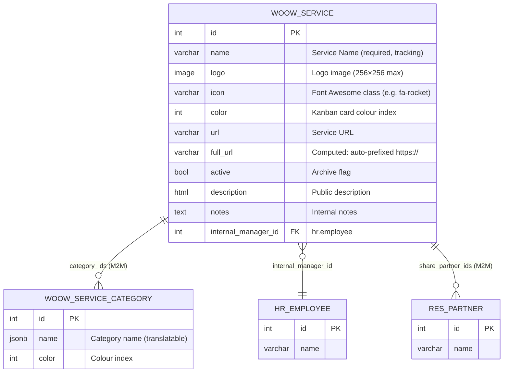
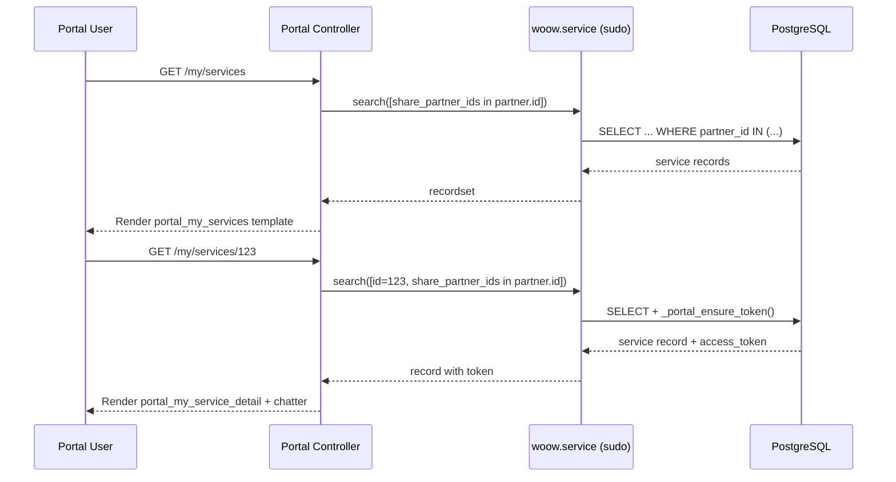
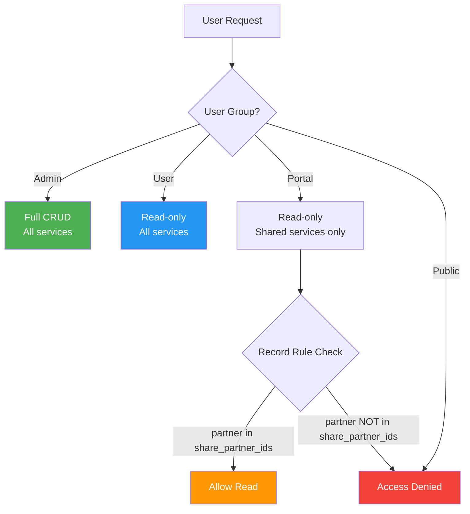

<p align="center">
  
</p>

<h1 align="center">WoowTech Service Hub</h1>

<p align="center">
  <strong>Internal SaaS & Service Portal for Odoo 18</strong><br/>
  Centralise all internal and external web services into a searchable card catalogue with portal sharing
</p>

<p align="center">
  <a href="#features">Features</a> &bull;
  <a href="#architecture">Architecture</a> &bull;
  <a href="#installation">Installation</a> &bull;
  <a href="#screenshots">Screenshots</a> &bull;
  <a href="#configuration">Configuration</a> &bull;
  <a href="#security">Security</a> &bull;
  <a href="#api-reference">API</a> &bull;
  <a href="README_zh-TW.md">中文文件</a>
</p>

<p align="center">
  
  
  
  
</p>

---

## Overview

**WoowTech Service Hub** is an Odoo 18 module that turns scattered SaaS bookmarks and internal tools into a colourful, searchable Kanban catalogue. Administrators manage services from the backend; portal contacts see only the services explicitly shared with them.

<p align="center">
  
</p>

### Why This Module?

| Challenge | Solution |
|-----------|----------|
| SaaS links scattered in wikis, bookmarks, Slack pins | One Kanban catalogue with icons, categories, and one-click launch |
| No visibility control for external contacts | Share specific services with portal users — they only see what you allow |
| No audit trail for service discussions | Built-in Odoo chatter on every service record |
| Admins and regular users need different permissions | Three-tier security: Admin (full CRUD) / User (read-only) / Portal (shared only) |
| No i18n support for multilingual teams | Full English + Traditional Chinese translation included |

---

## Features

### Backend — Service Management

- **Kanban Card Wall** — Visual cards with logo/icon fallback, colour-coded categories, and "Open Service" button
- **List & Form Views** — Full CRUD with URL auto-prefixing (`https://`), Font Awesome icon picker, and image upload
- **Category Tags** — Coloured tag system (Many2many) for organising services by type
- **Internal Manager** — Assign an `hr.employee` as the responsible person for each service
- **Chatter Integration** — `mail.thread` + `mail.activity.mixin` for per-service discussions and activity tracking
- **Archive/Unarchive** — Standard Odoo active flag for soft-deleting services

### Portal — External Service Sharing

- **Portal Home Entry** — Custom SVG cargo-ship icon appears in the `/my` portal dashboard
- **Service Card Grid** — Responsive card layout showing shared services with logo/icon/initial fallback
- **Service Detail Page** — Full service info with "Open Service" button, breadcrumbs, and portal chatter
- **Granular Sharing** — Share individual services with specific `res.partner` contacts via Many2many field

### Security & Access Control

- **Three Security Groups** — Admin (full CRUD), User (read-only), Portal (shared services only)
- **Record Rules** — Portal users can only read services where their partner is in `share_partner_ids`
- **ACL Matrix** — Fine-grained `ir.model.access` for both `woow.service` and `woow.service.category`

### Internationalisation

- **Bilingual** — Full `.pot` template + `zh_TW.po` translation for Traditional Chinese
- **Translatable Categories** — Category names support Odoo's built-in translation framework

---

## Architecture

### Module Structure

```
woow_service_hub/
├── __manifest__.py          # Module metadata, dependencies, data files
├── __init__.py
├── models/
│   ├── __init__.py
│   ├── woow_service.py      # Main service model (mail.thread, portal.mixin)
│   └── woow_service_category.py  # Category tag model
├── controllers/
│   ├── __init__.py
│   └── portal.py            # Portal routes (/my/services, /my/services/<id>)
├── views/
│   ├── woow_service_views.xml         # Kanban, list, form views
│   ├── woow_service_category_views.xml # Category list/form views
│   ├── woow_service_hub_menus.xml     # App menu and sub-menus
│   └── portal_templates.xml           # Portal QWeb templates
├── security/
│   ├── woow_service_hub_groups.xml    # User & Admin groups
│   ├── ir.model.access.csv           # ACL matrix
│   └── woow_service_hub_rules.xml    # Record-level rules
├── demo/
│   └── demo_data.xml        # 12 sample services + 8 categories
├── i18n/
│   ├── woow_service_hub.pot # Translation template
│   └── zh_TW.po             # Traditional Chinese translations
└── static/
    ├── description/
    │   └── icon.png          # Module icon (128×128, cargo ship)
    └── src/
        ├── css/
        │   └── portal.css    # Portal card grid styles
        └── img/
            └── service-hub.svg  # Portal sidebar icon (64×64 SVG)
```

### Data Model



### Request Flow



### Security Architecture



---

## Installation

### Prerequisites

- Odoo 18.0 Community or Enterprise
- Python 3.10+
- PostgreSQL 13+

### Dependencies

This module depends on the following Odoo modules:

| Module | Purpose |
|--------|---------|
| `mail` | Chatter, activity tracking, message threads |
| `portal` | Portal framework, portal.mixin, access tokens |
| `hr` | Employee model for internal manager assignment |

### Install Steps

1. Copy the `woow_service_hub` directory into your Odoo addons path:

```bash
cp -r woow_service_hub /path/to/odoo/addons/
```

2. Update the module list:

```bash
odoo -d your_database -u base --stop-after-init
```

3. Install from the Odoo Apps menu: search for **"Service Hub"** and click Install.

4. (Optional) Load demo data: the module ships with 12 sample services and 8 categories when `demo=True`.

---

## Screenshots

### Backend — Kanban View

12 service cards arranged in a 4-column Kanban grid. Each card displays the service name, Font Awesome icon, coloured category tags, and an "Open Service" launch button.

<p align="center">
  
</p>

### Backend — List View

Sortable table with columns: Service Name, Categories (colour tags), Service URL, and Internal Manager.

<p align="center">
  
</p>

### Backend — Form View

Full form with all fields: Service Name, URL (auto-prefixed), Icon, Logo upload, Category tags, Internal Manager, Card Colour. Tabs for Description, Sharing, and Notes. Built-in chatter at the bottom.

<p align="center">
  
</p>

### Backend — Categories

Category management with translatable names and colour indexes.

<p align="center">
  
</p>

### Portal — Home Dashboard

Custom cargo-ship SVG icon appears in the portal `/my` dashboard alongside standard Odoo portal entries.

<p align="center">
  
</p>

### Portal — Service Card Grid

Responsive card grid showing only the services shared with the logged-in portal user. Each card displays the service icon, name, and an "Open" button.

<p align="center">
  
</p>

### Portal — Service Detail

Service detail page with breadcrumb navigation, large icon, "Open Service" button, and portal chatter for customer communication.

<p align="center">
  
</p>

---

## Configuration

### Creating Services

1. Navigate to **Service Hub > All Services**
2. Click **New** to create a service
3. Fill in:
   - **Service Name** (required)
   - **Service URL** — auto-prefixed with `https://` if no scheme is provided
   - **Icon** — Font Awesome class name (e.g. `fa-slack`, `fa-github`)
   - **Logo** — Upload a custom image (256×256 max)
   - **Categories** — Select or create colour-coded tags
   - **Internal Manager** — Assign a responsible employee

### Sharing with Portal Users

1. Open a service record
2. Go to the **Sharing** tab
3. Add portal contacts to the **Shared With** field
4. The portal user will see the service at `/my/services`

### Managing Categories

1. Navigate to **Service Hub > Categories**
2. Create categories with translatable names and colour indexes
3. Categories appear as coloured tags on Kanban cards and list rows

---

## Security

### Access Groups

| Group | Read | Write | Create | Delete | Scope |
|-------|------|-------|--------|--------|-------|
| **Administrator** | Yes | Yes | Yes | Yes | All services |
| **User** | Yes | No | No | No | All services |
| **Portal** | Yes | No | No | No | Shared services only |

### Record Rules

| Rule | Group | Domain | Permissions |
|------|-------|--------|-------------|
| Portal: shared only | `base.group_portal` | `share_partner_ids in [user.partner_id.id]` | Read |
| User: read all | `woow_service_hub_group_user` | `[(1,'=',1)]` | Read |
| Admin: full access | `woow_service_hub_group_admin` | `[(1,'=',1)]` | Full CRUD |

### Portal Security

- Portal routes use `auth="user"` — no public access
- All portal queries use `sudo()` combined with partner-based domain filtering
- Access tokens are generated via `_portal_ensure_token()` for chatter security
- The portal controller verifies `share_partner_ids` contains the current user's partner before rendering

---

## API Reference

### Models

#### `woow.service`

| Field | Type | Description |
|-------|------|-------------|
| `name` | `Char` | Service name (required, tracking) |
| `logo` | `Image` | Logo image (256×256 max) |
| `icon` | `Char` | Font Awesome class (e.g. `fa-rocket`) |
| `color` | `Integer` | Kanban card colour index |
| `url` | `Char` | Service URL |
| `full_url` | `Char` | Computed: auto-prefixed with `https://` |
| `active` | `Boolean` | Archive flag (default: True) |
| `category_ids` | `Many2many` | Links to `woow.service.category` |
| `internal_manager_id` | `Many2one` | Links to `hr.employee` |
| `share_partner_ids` | `Many2many` | Links to `res.partner` (portal sharing) |
| `description` | `Html` | Public description (shown on portal) |
| `notes` | `Text` | Internal notes |

**Inherits:** `mail.thread`, `mail.activity.mixin`, `portal.mixin`

**Methods:**

| Method | Description |
|--------|-------------|
| `action_open_service()` | Opens `full_url` in a new browser tab |
| `_compute_full_url()` | Auto-prefixes URL with `https://` if no scheme |
| `_compute_access_url()` | Returns `/my/services/<id>` for portal access |

#### `woow.service.category`

| Field | Type | Description |
|-------|------|-------------|
| `name` | `Char` | Category name (required, translatable, unique) |
| `color` | `Integer` | Colour index for tags |

### Portal Routes

| Route | Method | Auth | Description |
|-------|--------|------|-------------|
| `/my/services` | GET | `user` | List shared services (card grid) |
| `/my/services/<int:id>` | GET | `user` | Service detail with chatter |

---

## Testing

The module ships with a comprehensive test suite (115 tests):

- **53 API tests** (`tests/test_api.py`) — Model CRUD, computed fields, access control, portal permissions, sharing logic
- **62 Playwright tests** (`tests/test_playwright.py`) — Full browser automation covering backend navigation, portal login, service card rendering, chatter interaction, and security boundaries

### Running Tests

```bash
# API tests
python -m pytest tests/test_api.py -v

# Playwright UI tests (requires running Odoo instance)
python -m pytest tests/test_playwright.py -v
```

---

## Changelog

### 18.0.1.0.0

- Initial release
- Kanban / List / Form views for service management
- Category tagging system with colour indexes
- Portal sharing with card grid and detail pages
- Portal chatter integration
- Three-tier security (Admin / User / Portal)
- Demo data: 12 services + 8 categories
- i18n: English + Traditional Chinese (zh_TW)

---

## License

This module is distributed under the [LGPL-3](https://www.gnu.org/licenses/lgpl-3.0.html) license.

## Author

**WoowTech** — [https://woowtech.com](https://woowtech.com)
