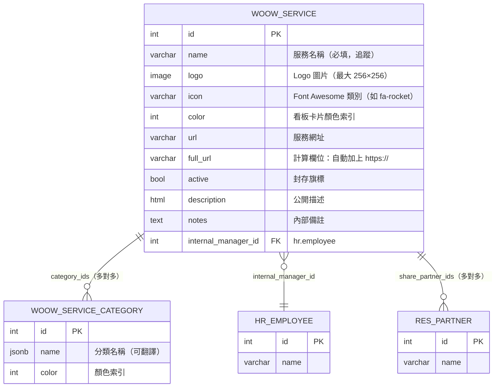
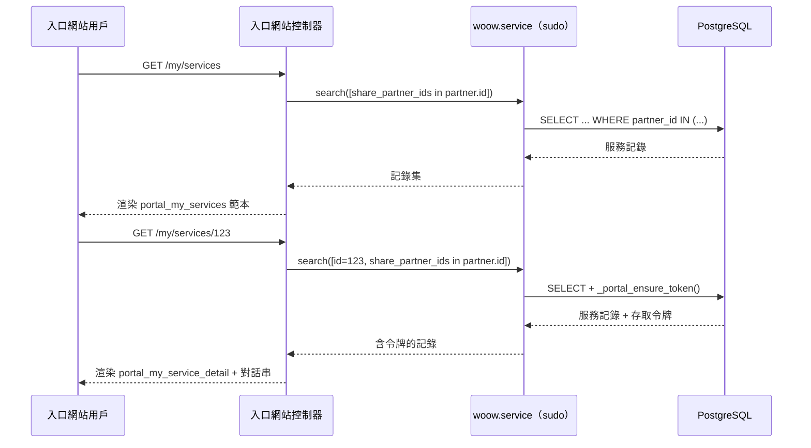
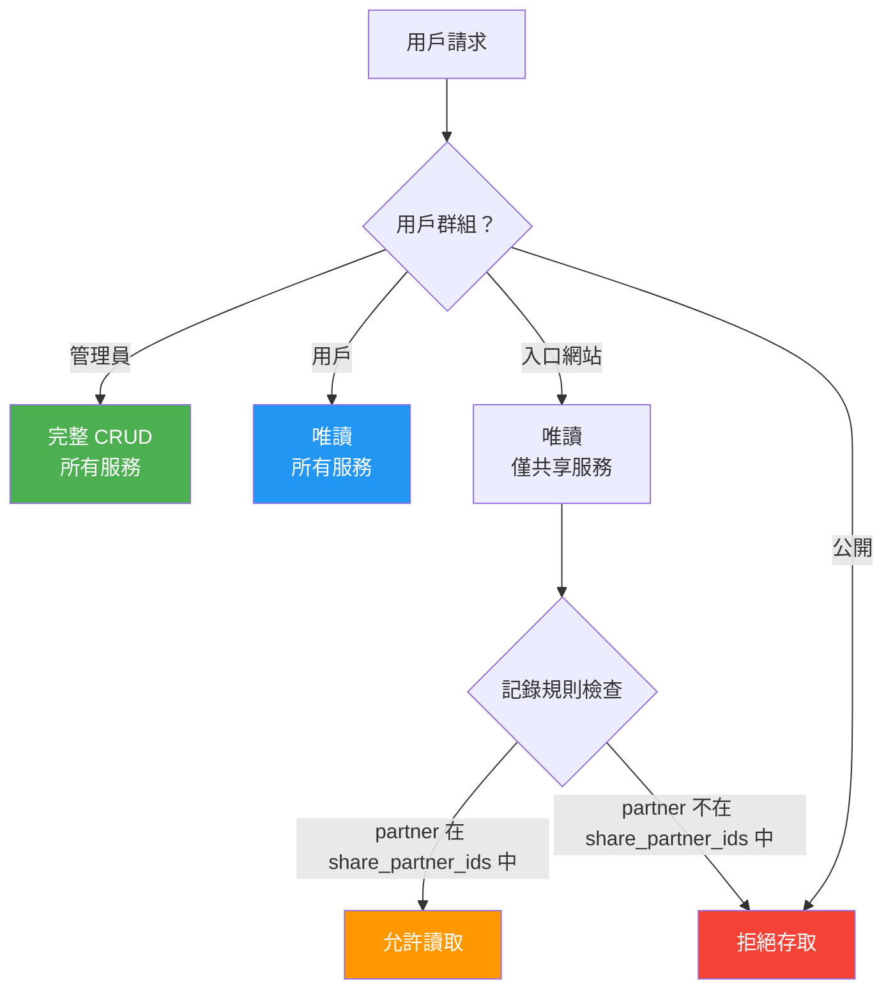

<p align="center">
  
</p>

<h1 align="center">WoowTech 服務中心</h1>

<p align="center">
  <strong>Odoo 18 內部 SaaS 與服務入口</strong><br/>
  將所有內部與外部網路服務集中管理，支援看板式目錄與入口網站共享
</p>

<p align="center">
  <a href="#功能特色">功能特色</a> &bull;
  <a href="#系統架構">系統架構</a> &bull;
  <a href="#安裝說明">安裝說明</a> &bull;
  <a href="#功能截圖">功能截圖</a> &bull;
  <a href="#設定指南">設定指南</a> &bull;
  <a href="#安全機制">安全機制</a> &bull;
  <a href="#api-參考">API 參考</a> &bull;
  <a href="README.md">English</a>
</p>

<p align="center">
  
  
  
  
</p>

---

## 概述

**WoowTech 服務中心** 是一個 Odoo 18 模組，將分散在各處的 SaaS 書籤和內部工具整合成一個彩色、可搜尋的看板目錄。管理員從後台管理服務；入口網站聯絡人僅能看到明確共享給他們的服務。

<p align="center">
  
</p>

### 為什麼需要此模組？

| 痛點 | 解決方案 |
|------|----------|
| SaaS 連結散落在 Wiki、書籤、Slack 訊息中 | 統一看板目錄，帶有圖示、分類標籤和一鍵啟動按鈕 |
| 外部聯絡人無法控制存取權限 | 與入口網站用戶共享特定服務 — 僅看到被允許的內容 |
| 服務討論無稽核紀錄 | 每筆服務記錄內建 Odoo 對話串 |
| 管理員和一般用戶需要不同權限 | 三級安全機制：管理員（完整 CRUD）/ 用戶（唯讀）/ 入口網站（僅共享） |
| 多語言團隊無 i18n 支援 | 內建完整英文 + 繁體中文翻譯 |

---

## 功能特色

### 後台 — 服務管理

- **看板卡片牆** — 視覺化卡片，帶有 Logo/圖示備選方案、彩色分類標籤和「開啟服務」按鈕
- **清單與表單視圖** — 完整 CRUD，網址自動加上 `https://` 前綴、Font Awesome 圖示選擇器、圖片上傳
- **分類標籤** — 多對多彩色標籤系統，依類型組織服務
- **內部負責人** — 為每個服務指定一位 `hr.employee` 負責人
- **對話串整合** — `mail.thread` + `mail.activity.mixin`，支援逐筆服務的討論和活動追蹤
- **封存/取消封存** — 標準 Odoo active 旗標，支援軟刪除

### 入口網站 — 外部服務共享

- **入口首頁項目** — 自訂的貨櫃船 SVG 圖示顯示在 `/my` 入口網站儀表板
- **服務卡片網格** — 響應式卡片版面，顯示共享服務的 Logo/圖示/首字母備選
- **服務詳情頁面** — 完整服務資訊，含「開啟服務」按鈕、麵包屑導覽和入口網站對話串
- **精細共享** — 透過多對多欄位，將個別服務共享給特定的 `res.partner` 聯絡人

### 安全與存取控制

- **三個安全群組** — 管理員（完整 CRUD）、用戶（唯讀）、入口網站（僅共享服務）
- **記錄規則** — 入口網站用戶僅能讀取其合作夥伴在 `share_partner_ids` 中的服務
- **ACL 矩陣** — 針對 `woow.service` 和 `woow.service.category` 的細粒度存取控制

### 國際化

- **雙語支援** — 完整 `.pot` 範本 + `zh_TW.po` 繁體中文翻譯
- **可翻譯分類** — 分類名稱支援 Odoo 內建翻譯框架

---

## 系統架構

### 模組結構

```
woow_service_hub/
├── __manifest__.py          # 模組資訊、依賴關係、資料檔案
├── __init__.py
├── models/
│   ├── __init__.py
│   ├── woow_service.py      # 主服務模型（mail.thread, portal.mixin）
│   └── woow_service_category.py  # 分類標籤模型
├── controllers/
│   ├── __init__.py
│   └── portal.py            # 入口網站路由（/my/services, /my/services/<id>）
├── views/
│   ├── woow_service_views.xml         # 看板、清單、表單視圖
│   ├── woow_service_category_views.xml # 分類清單/表單視圖
│   ├── woow_service_hub_menus.xml     # 應用程式選單和子選單
│   └── portal_templates.xml           # 入口網站 QWeb 範本
├── security/
│   ├── woow_service_hub_groups.xml    # 用戶與管理員群組
│   ├── ir.model.access.csv           # ACL 矩陣
│   └── woow_service_hub_rules.xml    # 記錄層級規則
├── demo/
│   └── demo_data.xml        # 12 個範例服務 + 8 個分類
├── i18n/
│   ├── woow_service_hub.pot # 翻譯範本
│   └── zh_TW.po             # 繁體中文翻譯
└── static/
    ├── description/
    │   └── icon.png          # 模組圖示（128×128，貨櫃船）
    └── src/
        ├── css/
        │   └── portal.css    # 入口網站卡片網格樣式
        └── img/
            └── service-hub.svg  # 入口網站側邊欄圖示（64×64 SVG）
```

### 資料模型



### 請求流程



### 安全架構



---

## 安裝說明

### 前置需求

- Odoo 18.0 社區版或企業版
- Python 3.10+
- PostgreSQL 13+

### 模組依賴

| 模組 | 用途 |
|------|------|
| `mail` | 對話串、活動追蹤、訊息討論串 |
| `portal` | 入口網站框架、portal.mixin、存取令牌 |
| `hr` | 員工模型，用於指定內部負責人 |

### 安裝步驟

1. 將 `woow_service_hub` 目錄複製到你的 Odoo 擴充模組路徑：

```bash
cp -r woow_service_hub /path/to/odoo/addons/
```

2. 更新模組列表：

```bash
odoo -d your_database -u base --stop-after-init
```

3. 從 Odoo 應用程式選單安裝：搜尋 **「Service Hub」** 並點擊安裝。

4.（選用）載入示範資料：模組在 `demo=True` 時附帶 12 個範例服務和 8 個分類。

---

## 功能截圖

### 後台 — 看板視圖

12 個服務卡片排列在 4 欄看板網格中。每張卡片顯示服務名稱、Font Awesome 圖示、彩色分類標籤和「開啟服務」啟動按鈕。

<p align="center">
  
</p>

### 後台 — 清單視圖

可排序的表格，包含欄位：服務名稱、分類（彩色標籤）、服務網址和內部負責人。

<p align="center">
  
</p>

### 後台 — 表單視圖

完整表單，包含所有欄位：服務名稱、網址（自動加前綴）、圖示、Logo 上傳、分類標籤、內部負責人、卡片顏色。標籤頁分為描述、共享和備註。底部內建對話串。

<p align="center">
  
</p>

### 後台 — 分類管理

分類管理，支援可翻譯名稱和顏色索引。

<p align="center">
  
</p>

### 入口網站 — 首頁儀表板

自訂的貨櫃船 SVG 圖示顯示在入口網站 `/my` 儀表板中，與標準 Odoo 入口網站項目並列。

<p align="center">
  
</p>

### 入口網站 — 服務卡片網格

響應式卡片網格，僅顯示與已登入入口網站用戶共享的服務。每張卡片顯示服務圖示、名稱和「開啟」按鈕。

<p align="center">
  
</p>

### 入口網站 — 服務詳情

服務詳情頁面，包含麵包屑導覽、大圖示、「開啟服務」按鈕和入口網站對話串，供客戶溝通使用。

<p align="center">
  
</p>

---

## 設定指南

### 建立服務

1. 前往 **服務中心 > 所有服務**
2. 點擊 **新增** 建立服務
3. 填寫：
   - **服務名稱**（必填）
   - **服務網址** — 若未提供協定，自動加上 `https://` 前綴
   - **圖示** — Font Awesome 類別名稱（如 `fa-slack`、`fa-github`）
   - **Logo** — 上傳自訂圖片（最大 256×256）
   - **分類** — 選擇或建立彩色標籤
   - **內部負責人** — 指定一位負責的員工

### 與入口網站用戶共享

1. 開啟一筆服務記錄
2. 前往 **共享** 標籤頁
3. 在 **共享對象** 欄位中新增入口網站聯絡人
4. 入口網站用戶將在 `/my/services` 看到該服務

### 管理分類

1. 前往 **服務中心 > 分類**
2. 建立帶有可翻譯名稱和顏色索引的分類
3. 分類會以彩色標籤形式顯示在看板卡片和清單列中

---

## 安全機制

### 存取群組

| 群組 | 讀取 | 寫入 | 建立 | 刪除 | 範圍 |
|------|------|------|------|------|------|
| **管理員** | 是 | 是 | 是 | 是 | 所有服務 |
| **用戶** | 是 | 否 | 否 | 否 | 所有服務 |
| **入口網站** | 是 | 否 | 否 | 否 | 僅共享服務 |

### 記錄規則

| 規則 | 群組 | Domain | 權限 |
|------|------|--------|------|
| 入口網站：僅共享 | `base.group_portal` | `share_partner_ids in [user.partner_id.id]` | 讀取 |
| 用戶：讀取全部 | `woow_service_hub_group_user` | `[(1,'=',1)]` | 讀取 |
| 管理員：完整存取 | `woow_service_hub_group_admin` | `[(1,'=',1)]` | 完整 CRUD |

### 入口網站安全

- 入口網站路由使用 `auth="user"` — 無公開存取
- 所有入口網站查詢使用 `sudo()` 搭配基於合作夥伴的 domain 過濾
- 透過 `_portal_ensure_token()` 產生存取令牌以確保對話串安全
- 入口網站控制器在渲染前驗證 `share_partner_ids` 是否包含當前用戶的合作夥伴

---

## API 參考

### 模型

#### `woow.service`

| 欄位 | 類型 | 說明 |
|------|------|------|
| `name` | `Char` | 服務名稱（必填，追蹤） |
| `logo` | `Image` | Logo 圖片（最大 256×256） |
| `icon` | `Char` | Font Awesome 類別（如 `fa-rocket`） |
| `color` | `Integer` | 看板卡片顏色索引 |
| `url` | `Char` | 服務網址 |
| `full_url` | `Char` | 計算欄位：自動加上 `https://` 前綴 |
| `active` | `Boolean` | 封存旗標（預設：True） |
| `category_ids` | `Many2many` | 連結至 `woow.service.category` |
| `internal_manager_id` | `Many2one` | 連結至 `hr.employee` |
| `share_partner_ids` | `Many2many` | 連結至 `res.partner`（入口網站共享） |
| `description` | `Html` | 公開描述（顯示在入口網站） |
| `notes` | `Text` | 內部備註 |

**繼承：** `mail.thread`、`mail.activity.mixin`、`portal.mixin`

**方法：**

| 方法 | 說明 |
|------|------|
| `action_open_service()` | 在新瀏覽器分頁開啟 `full_url` |
| `_compute_full_url()` | 若無協定則自動加上 `https://` 前綴 |
| `_compute_access_url()` | 回傳 `/my/services/<id>` 供入口網站存取 |

#### `woow.service.category`

| 欄位 | 類型 | 說明 |
|------|------|------|
| `name` | `Char` | 分類名稱（必填，可翻譯，唯一） |
| `color` | `Integer` | 顏色索引 |

### 入口網站路由

| 路由 | 方法 | 認證 | 說明 |
|------|------|------|------|
| `/my/services` | GET | `user` | 列出共享服務（卡片網格） |
| `/my/services/<int:id>` | GET | `user` | 服務詳情頁含對話串 |

---

## 測試

模組附帶完整測試套件（115 項測試）：

- **53 項 API 測試**（`tests/test_api.py`）— 模型 CRUD、計算欄位、存取控制、入口網站權限、共享邏輯
- **62 項 Playwright 測試**（`tests/test_playwright.py`）— 完整瀏覽器自動化，涵蓋後台導覽、入口網站登入、服務卡片渲染、對話串互動和安全邊界

### 執行測試

```bash
# API 測試
python -m pytest tests/test_api.py -v

# Playwright UI 測試（需要執行中的 Odoo 實例）
python -m pytest tests/test_playwright.py -v
```

---

## 更新日誌

### 18.0.1.0.0

- 首次發行
- 看板 / 清單 / 表單視圖的服務管理
- 分類標籤系統，帶顏色索引
- 入口網站共享，含卡片網格和詳情頁面
- 入口網站對話串整合
- 三級安全機制（管理員 / 用戶 / 入口網站）
- 示範資料：12 個服務 + 8 個分類
- 國際化：英文 + 繁體中文（zh_TW）

---

## 授權條款

此模組以 [LGPL-3](https://www.gnu.org/licenses/lgpl-3.0.html) 授權條款發行。

## 作者

**WoowTech** — [https://woowtech.com](https://woowtech.com)
