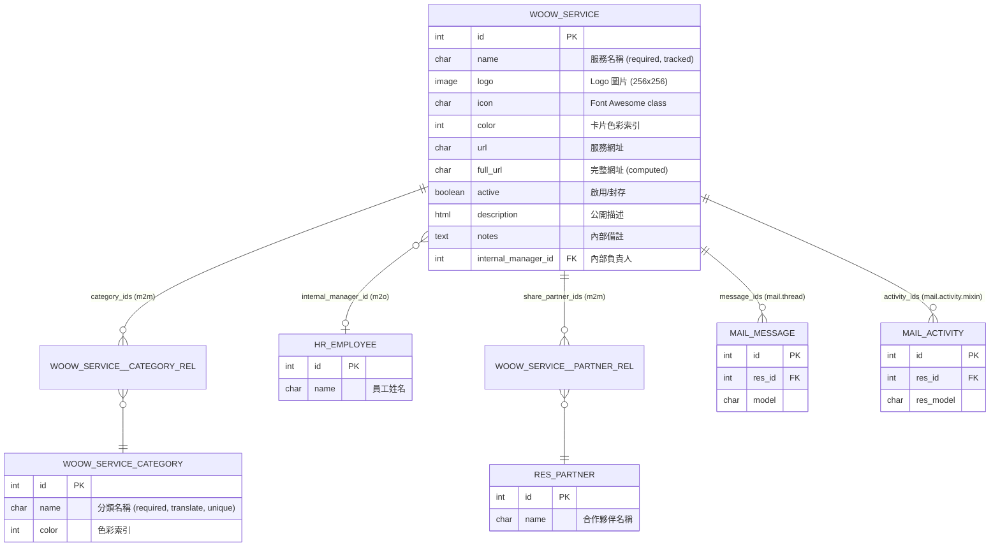
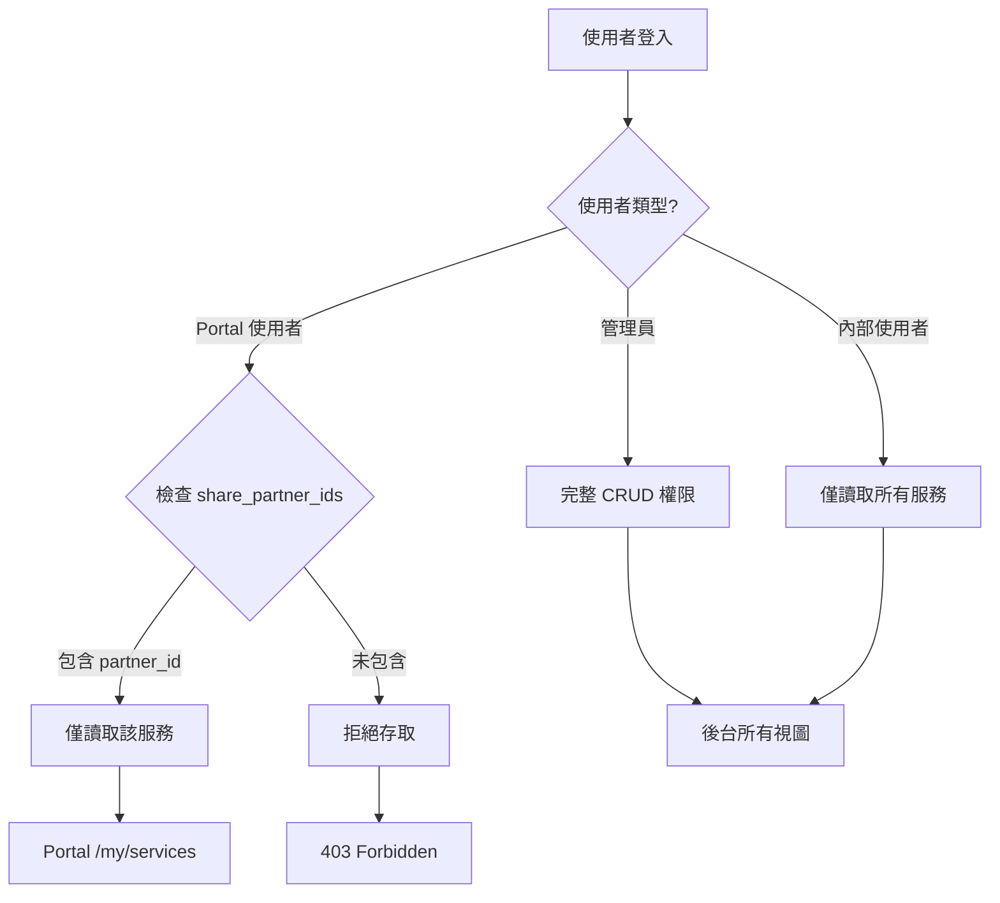

# WoowTech 服務中心 (woow_service_hub) 操作手冊

> **模組名稱**：WoowTech 服務中心 (woow_service_hub)
> **Odoo 版本**：18.0 Community Edition
> **模組版本**：18.0.1.0.0
> **授權**：LGPL-3
> **作者**：WoowTech
> **最後更新**：2026-06-06

---

## 目錄

| 章節 | 標題 | 頁面 |
|------|------|------|
| [1](#1-模組總覽) | 模組總覽 | 功能摘要與適用場景 |
| [2](#2-系統架構) | 系統架構 | 模組結構、資料模型、相依模組 |
| [3](#3-安裝與啟用) | 安裝與啟用 | 前置需求、安裝步驟 |
| [4](#4-後台操作看板視圖) | 後台操作：看板視圖 | Kanban 卡片牆操作說明 |
| [5](#5-後台操作清單視圖) | 後台操作：清單視圖 | List 視圖操作說明 |
| [6](#6-後台操作表單視圖) | 後台操作：表單視圖 | Form 視圖欄位說明 |
| [7](#7-分類管理) | 分類管理 | 分類的新增、編輯、刪除 |
| [8](#8-服務建立流程) | 服務建立流程 | 逐步建立新服務 |
| [9](#9-對外分享設定) | 對外分享設定 | 分享服務給 Portal 使用者 |
| [10](#10-portal-入口首頁) | Portal 入口首頁 | Portal 首頁入口說明 |
| [11](#11-portal-服務清單) | Portal 服務清單 | Portal 服務卡片牆 |
| [12](#12-portal-服務詳情) | Portal 服務詳情 | Portal 服務詳情頁面 |
| [13](#13-權限與安全機制) | 權限與安全機制 | 安全群組、Record Rules、ACL |
| [14](#14-chatter-討論功能) | Chatter 討論功能 | 訊息追蹤與討論串 |
| [15](#15-api-參考) | API 參考 | Model 欄位、方法、Portal 路由 |
| [16](#16-常見問題-faq) | 常見問題 (FAQ) | 疑難排解 |
| [17](#17-變更日誌) | 變更日誌 | 版本歷史紀錄 |

---

## 1. 模組總覽

### 1.1 解決的問題

企業內部經常使用多種 SaaS 服務（如 Slack、Notion、GitHub、Figma 等），但這些服務入口分散，員工需要自行記憶或收藏大量書籤。對於 Portal 外部合作夥伴而言，更難以得知可用的服務資源。

**WoowTech 服務中心** 將所有服務統一管理，提供：

- 後台集中式服務目錄管理
- 支援分類、圖示、色彩標籤的視覺化看板
- Portal 使用者的服務入口頁面
- 精細的權限控管機制

### 1.2 功能摘要

| 功能 | 說明 |
|------|------|
| 服務目錄管理 | 新增、編輯、封存、刪除服務項目 |
| 分類標籤 | 透過 Many2many 分類標籤組織服務 |
| 三種後台視圖 | Kanban 看板 / List 清單 / Form 表單 |
| 圖示支援 | 上傳 Logo 圖片或使用 Font Awesome icon class |
| 自動 URL 補全 | 自動為網址補上 `https://` 前綴 |
| Portal 分享 | 將服務分享給指定的 Portal 合作夥伴 |
| Portal 瀏覽頁面 | Portal 使用者可瀏覽被分享的服務清單與詳情 |
| Chatter 討論 | 繼承 `mail.thread`，支援訊息追蹤與備註 |
| 內部負責人 | 連結 `hr.employee` 指定服務負責人 |
| 多語系支援 | 內建繁體中文 (`zh_TW`) 翻譯 |

### 1.3 適用對象

| 角色 | 使用情境 |
|------|----------|
| 系統管理員 | 安裝模組、設定權限群組 |
| 服務管理員 (Admin) | 建立與管理服務目錄、分類、分享設定 |
| 內部使用者 (User) | 瀏覽服務目錄（唯讀） |
| Portal 使用者 | 透過 `/my/services` 瀏覽被分享的服務 |

---

## 2. 系統架構

### 2.1 模組目錄結構

```
woow_service_hub/
├── __init__.py
├── __manifest__.py
├── models/
│   ├── __init__.py
│   ├── woow_service.py
│   └── woow_service_category.py
├── controllers/
│   ├── __init__.py
│   └── portal.py
├── views/
│   ├── woow_service_views.xml
│   ├── woow_service_category_views.xml
│   ├── woow_service_hub_menus.xml
│   └── portal_templates.xml
├── security/
│   ├── woow_service_hub_groups.xml
│   ├── ir.model.access.csv
│   └── woow_service_hub_rules.xml
├── demo/
│   └── demo_data.xml
├── i18n/
│   ├── woow_service_hub.pot
│   └── zh_TW.po
└── static/
    ├── description/
    │   └── icon.png
    └── src/
        ├── css/
        │   └── portal.css
        └── img/
            └── service-hub.svg
```

| 目錄 / 檔案 | 用途 |
|-------------|------|
| `models/` | Python Model 定義（`woow.service`、`woow.service.category`） |
| `controllers/` | Portal 路由控制器 |
| `views/` | 後台視圖 XML（Kanban、List、Form、Menu）與 Portal QWeb 模板 |
| `security/` | 安全群組、ACL 矩陣、Record Rules |
| `demo/` | 示範資料（安裝時可選載入） |
| `i18n/` | 翻譯檔案（`.pot` 模板 + `zh_TW.po` 繁中翻譯） |
| `static/` | 靜態資源（CSS、圖片、模組圖示） |

### 2.2 資料模型 (ER Diagram)



### 2.3 相依模組

| 模組 | 用途 |
|------|------|
| `mail` | Chatter 討論串、訊息追蹤（`mail.thread`、`mail.activity.mixin`） |
| `portal` | Portal mixin（`portal.mixin`）、`/my` 路由基礎設施 |
| `hr` | `hr.employee` 模型連結，用於指定服務的內部負責人 |

> **注意**：以上三個模組皆為 Odoo 18.0 Community Edition 內建模組，無需額外安裝第三方套件。

### 2.4 繼承關係

`woow.service` 模型繼承以下 Mixin：

| Mixin | 來源模組 | 提供功能 |
|-------|----------|----------|
| `mail.thread` | `mail` | Chatter 訊息串、欄位追蹤 (tracking)、寄信通知 |
| `mail.activity.mixin` | `mail` | 排程活動 (Scheduled Activities) |
| `portal.mixin` | `portal` | `access_url` computed field、Portal 存取路徑計算 |

---

## 3. 安裝與啟用

### 3.1 前置需求

在安裝本模組之前，請確認以下環境條件已滿足：

| 項目 | 需求 |
|------|------|
| Odoo 版本 | 18.0 Community Edition |
| Python 版本 | 3.10 以上 |
| 相依模組 | `mail`、`portal`、`hr`（Odoo 內建） |
| 資料庫 | PostgreSQL 14 以上 |
| 管理員權限 | 需具備 Odoo 系統管理員 (Settings > Technical) 權限 |

### 3.2 安裝步驟

1. **取得模組原始碼**

   將 `woow_service_hub` 資料夾放置於 Odoo 的 addons 路徑下：

   ```bash
   cp -r woow_service_hub /opt/odoo/addons/
   ```

   或者在 `odoo.conf` 中加入自訂 addons 路徑：

   ```ini
   [options]
   addons_path = /opt/odoo/odoo/addons,/opt/odoo/addons,/path/to/woow_service_hub/..
   ```

2. **重啟 Odoo 服務**

   ```bash
   sudo systemctl restart odoo
   ```

3. **更新模組清單**

   進入 Odoo 後台：
   - 前往 **設定 (Settings)** > **啟用開發者模式 (Developer Mode)**
   - 前往 **應用程式 (Apps)** > 點擊 **更新模組清單 (Update Apps List)**
   - 在彈出對話框中確認更新

4. **搜尋並安裝模組**

   - 在 **應用程式 (Apps)** 頁面中，移除預設篩選條件
   - 搜尋 `woow_service_hub` 或 `WoowTech`
   - 找到 **WoowTech 服務中心** 模組，點擊 **安裝 (Install)**

5. **確認安裝成功**

   安裝完成後，你將在主選單中看到新增的 **服務中心 (Service Hub)** 選單項目。

### 3.3 載入示範資料（可選）

如需載入示範資料以快速體驗功能，可在安裝時勾選 **載入示範資料 (Load Demo Data)** 選項，或透過命令列：

```bash
odoo -d your_database -i woow_service_hub --load-demo-data
```

示範資料包含預建的服務項目（如 Slack、Notion、GitHub 等）與分類標籤。

---

## 4. 後台操作：看板視圖

看板 (Kanban) 視圖提供視覺化的卡片牆介面，讓管理員一目瞭然地瀏覽所有服務項目。


*圖 1：後台 Kanban 看板視圖 — 以卡片形式呈現服務項目，包含色彩標籤與 Font Awesome 圖示*

### 4.1 看板卡片元素

每張看板卡片包含以下資訊：

| 元素 | 說明 |
|------|------|
| Logo / Icon | 若有上傳 Logo 則顯示圖片；否則顯示 Font Awesome icon（如 `fa-rocket`） |
| 服務名稱 | 卡片標題，顯示 `name` 欄位值 |
| 分類標籤 | 以彩色標籤 (tags) 呈現所屬分類 |
| 色彩條 | 卡片左側的色彩條由 `color` 欄位決定 |

### 4.2 看板操作

1. **瀏覽服務** — 在看板畫面中捲動瀏覽所有服務卡片。
2. **快速篩選** — 使用上方的搜尋列，可依服務名稱或分類進行篩選。
3. **開啟服務表單** — 點擊任一卡片即可開啟該服務的表單視圖 (Form View)。
4. **新增服務** — 點擊左上角的 **建立 (New)** 按鈕新增服務。
5. **切換視圖** — 使用右上角的視圖切換按鈕，可切換至清單視圖或表單視圖。

### 4.3 看板分組

看板支援以下分組方式：

- **依分類分組** — 依據 `category_ids` 分組顯示
- **依色彩分組** — 依據 `color` 欄位分組

> **提示**：在搜尋列中選擇 **群組依據 (Group By)** 可自訂分組方式。

---

## 5. 後台操作：清單視圖

清單 (List / Tree) 視圖提供表格形式的服務列表，適合大量資料的快速瀏覽與排序。


*圖 2：後台 List 清單視圖 — 以表格形式呈現服務名稱、分類、網址等欄位*

### 5.1 清單欄位

清單視圖預設顯示以下欄位：

| 欄位 | 說明 |
|------|------|
| 服務名稱 (Name) | 服務的主要名稱 |
| 分類 (Categories) | 所屬分類標籤（以色彩 tag 呈現） |
| 服務網址 (URL) | 服務的連結網址 |
| 內部負責人 (Internal Manager) | 負責該服務的內部員工 |
| 啟用狀態 (Active) | 是否啟用 |

### 5.2 清單操作

1. **排序** — 點擊欄位標題可依該欄位升序/降序排列。
2. **多選操作** — 勾選多筆記錄後，可使用上方的 **動作 (Actions)** 按鈕進行批次操作（如封存、刪除）。
3. **快速搜尋** — 使用搜尋列輸入關鍵字，支援以服務名稱、分類名稱進行搜尋。
4. **匯出** — 選取記錄後可匯出為 CSV 或 Excel 格式。
5. **開啟詳情** — 點擊任一列即可開啟該服務的表單視圖。

---

## 6. 後台操作：表單視圖

表單 (Form) 視圖是管理服務項目的主要介面，包含所有欄位與 Chatter 討論區。


*圖 3：後台 Form 表單視圖 — 以 Slack 服務為例，展示所有欄位與 Chatter 討論串*

### 6.1 欄位說明

#### 基本資訊區

| 欄位 | 類型 | 必填 | 追蹤 | 說明 |
|------|------|------|------|------|
| 服務名稱 (Name) | `Char` | 是 | 是 | 服務的主要名稱，如「Slack」「Notion」 |
| Logo | `Image` | 否 | 否 | 服務的 Logo 圖片，最大尺寸 256x256 像素 |
| 圖示 (Icon) | `Char` | 否 | 否 | Font Awesome class 名稱（如 `fa-rocket`、`fa-slack`），當無 Logo 時作為替代圖示 |
| 色彩 (Color) | `Integer` | 否 | 否 | Odoo 色彩索引值（0-11），決定看板卡片的色彩 |

#### 服務連結區

| 欄位 | 類型 | 必填 | 說明 |
|------|------|------|------|
| 服務網址 (URL) | `Char` | 否 | 使用者輸入的服務網址（如 `slack.com`） |
| 完整網址 (Full URL) | `Char` | — | **計算欄位**，自動為 URL 補上 `https://` 前綴 |

> **範例**：使用者輸入 `slack.com` → `full_url` 自動計算為 `https://slack.com`。若已包含 `http://` 或 `https://` 前綴則不再重複加上。

#### 組織與負責人區

| 欄位 | 類型 | 必填 | 說明 |
|------|------|------|------|
| 分類 (Categories) | `Many2many` → `woow.service.category` | 否 | 一個服務可同時屬於多個分類 |
| 內部負責人 (Internal Manager) | `Many2one` → `hr.employee` | 否 | 指定此服務的內部負責員工 |
| 啟用 (Active) | `Boolean` | — | 預設為 `True`。取消勾選即封存服務 |

#### 分享設定區

| 欄位 | 類型 | 必填 | 說明 |
|------|------|------|------|
| 分享對象 (Shared Partners) | `Many2many` → `res.partner` | 否 | 指定可在 Portal 檢視此服務的合作夥伴 |

#### 描述區

| 欄位 | 類型 | 必填 | 說明 |
|------|------|------|------|
| 公開描述 (Description) | `Html` | 否 | 服務的公開描述，支援富文本編輯。此內容會顯示在 Portal 服務詳情頁面 |
| 內部備註 (Notes) | `Text` | 否 | 僅供內部人員檢視的純文字備註，Portal 使用者不可見 |

### 6.2 表單操作按鈕

| 按鈕 | 功能 |
|------|------|
| **開啟服務 (Open Service)** | 呼叫 `action_open_service()` 方法，在新分頁中開啟 `full_url` |
| **儲存 (Save)** | 儲存目前的表單變更 |
| **捨棄 (Discard)** | 捨棄未儲存的變更 |

### 6.3 Chatter 區域

表單下方為 Chatter 討論區域，包含：

- **傳送訊息 (Send Message)** — 發送訊息並通知追蹤者
- **記錄備註 (Log Note)** — 記錄內部備註（不通知）
- **排程活動 (Schedule Activity)** — 建立待辦活動
- **追蹤歷史** — 欄位變更記錄（Name 欄位有 `tracked=True`）

---

## 7. 分類管理

分類 (Category) 用於組織服務項目，支援新增、編輯、刪除操作。


*圖 4：分類管理清單視圖 — 顯示分類名稱與色彩色塊*

### 7.1 進入分類管理

1. 在主選單中點擊 **服務中心 (Service Hub)**。
2. 在子選單中點擊 **分類 (Categories)**。

### 7.2 新增分類

1. 點擊 **建立 (New)** 按鈕。
2. 輸入 **分類名稱 (Name)** — 此欄位為必填，且在系統中必須唯一。
3. 選擇 **色彩 (Color)** — 從 Odoo 色彩選擇器中選取色彩索引（0-11）。
4. 點擊 **儲存 (Save)**。

### 7.3 編輯分類

1. 在分類清單中點擊目標分類。
2. 修改分類名稱或色彩。
3. 點擊 **儲存 (Save)**。

> **注意**：分類名稱支援翻譯 (`translate=True`)。如需設定多語系名稱，請在欄位旁點擊翻譯圖示 (🌐)。

### 7.4 刪除分類

1. 在分類清單中勾選目標分類。
2. 點擊上方的 **動作 (Actions)** > **刪除 (Delete)**。
3. 在確認對話框中點擊 **確定 (OK)**。

> **警告**：刪除分類不會刪除其下的服務項目，僅移除分類與服務之間的關聯。

---

## 8. 服務建立流程

本章節以逐步方式說明如何建立一個新的服務項目。

### 8.1 完整建立流程

**步驟 1：進入服務清單**

1. 在主選單中點擊 **服務中心 (Service Hub)**。
2. 在子選單中點擊 **服務 (Services)**。

**步驟 2：建立新服務**

3. 點擊左上角的 **建立 (New)** 按鈕，系統將開啟空白的服務表單。

**步驟 3：填寫基本資訊**

4. 在 **服務名稱 (Name)** 欄位輸入服務名稱（必填），例如：`Slack`。
5. 上傳 **Logo** 圖片（建議尺寸 256x256 像素），或在 **圖示 (Icon)** 欄位填寫 Font Awesome class 名稱，例如：`fa-slack`。
6. 選擇 **色彩 (Color)** 索引值。

**步驟 4：設定服務連結**

7. 在 **服務網址 (URL)** 欄位輸入網址，例如：`slack.com`。
8. 系統會自動計算 **完整網址 (Full URL)** 為 `https://slack.com`。

**步驟 5：指定分類與負責人**

9. 在 **分類 (Categories)** 欄位中選取一或多個分類標籤。若需新增分類，可直接輸入名稱並選擇「建立」。
10. 在 **內部負責人 (Internal Manager)** 欄位中選取負責此服務的員工。

**步驟 6：填寫描述**

11. 在 **公開描述 (Description)** 欄位中以富文本格式撰寫服務描述。此內容將顯示在 Portal 服務詳情頁面。
12. 如有需要，在 **內部備註 (Notes)** 中記錄內部參考資訊。

**步驟 7：設定分享對象**

13. 在 **分享對象 (Shared Partners)** 欄位中加入需要在 Portal 檢視此服務的合作夥伴。

**步驟 8：儲存**

14. 點擊 **儲存 (Save)** 按鈕完成建立。

### 8.2 快速驗證

建立完成後，你可以：

- 點擊 **開啟服務 (Open Service)** 按鈕，確認服務網址可正常開啟。
- 切換到 Kanban 視圖，確認卡片顯示正確。
- 以 Portal 使用者登入，確認服務出現在 `/my/services` 頁面。

---

## 9. 對外分享設定

服務中心支援將服務項目分享給 Portal 使用者（外部合作夥伴），讓他們能透過 Portal 瀏覽服務目錄。

### 9.1 分享機制說明

分享機制透過 `share_partner_ids` 欄位運作：

| 設定 | 結果 |
|------|------|
| `share_partner_ids` 包含某 Partner | 該 Partner 的 Portal 帳號可看到此服務 |
| `share_partner_ids` 為空 | 此服務不會顯示在任何 Portal 使用者的清單中 |

### 9.2 設定步驟

1. 開啟目標服務的表單視圖。
2. 找到 **分享對象 (Shared Partners)** 欄位。
3. 點擊欄位，在下拉選單中搜尋並選取目標合作夥伴。
4. 可加入多個合作夥伴，以逗號分隔。
5. 點擊 **儲存 (Save)**。

### 9.3 確認 Portal 使用者已建立

確保目標合作夥伴已具有 Portal 帳號：

1. 前往 **聯絡人 (Contacts)** 模組。
2. 找到目標合作夥伴。
3. 點擊 **動作 (Action)** > **授予 Portal 存取權限 (Grant Portal Access)**。
4. 確認合作夥伴收到 Portal 邀請信件並完成帳號設定。

### 9.4 批次分享

若需將多個服務同時分享給同一位合作夥伴，可在清單視圖中批次操作：

1. 切換到清單視圖。
2. 勾選需要分享的服務項目。
3. 使用 server action 或手動逐一編輯 `share_partner_ids` 欄位。

---

## 10. Portal 入口首頁

Portal 使用者登入後，可在 Portal 首頁 (`/my`) 看到 **服務 (Services)** 入口。


*圖 5：Portal 首頁 — 顯示「Services」入口項目，以貨船圖示標示*

### 10.1 入口說明

| 元素 | 說明 |
|------|------|
| 入口圖示 | 貨船圖示（cargo ship icon），代表服務中心 |
| 入口標題 | **Services** |
| 計數徽章 | 顯示該 Portal 使用者可存取的服務數量 |

### 10.2 存取方式

1. Portal 使用者以其帳號密碼登入 Odoo Portal。
2. 在 `/my` 首頁中找到 **Services** 入口。
3. 點擊入口即可進入服務清單頁面。

---

## 11. Portal 服務清單

Portal 服務清單以卡片網格 (Card Grid) 形式呈現被分享的服務項目。


*圖 6：Portal 服務卡片網格 — 顯示 6 項被分享給 Portal User 的服務*

### 11.1 卡片元素

每張服務卡片包含：

| 元素 | 說明 |
|------|------|
| Logo / Icon | 服務 Logo 圖片或 Font Awesome 圖示 |
| 服務名稱 | 服務的標題 |
| 分類標籤 | 彩色分類標籤 |
| 簡要描述 | 服務描述的摘要文字 |

### 11.2 操作

1. **瀏覽服務** — 在頁面中瀏覽所有被分享的服務卡片。
2. **點擊查看詳情** — 點擊任一卡片即可進入該服務的詳情頁面。

### 11.3 存取路由

| 路由 | 方法 | 說明 |
|------|------|------|
| `/my/services` | `GET` | 顯示被分享給當前 Portal 使用者的服務卡片網格 |

> **注意**：Portal 使用者僅能看到 `share_partner_ids` 包含其 `partner_id` 的服務項目。未被分享的服務不會出現在清單中。

---

## 12. Portal 服務詳情

Portal 服務詳情頁面提供單一服務的完整資訊與 Chatter 討論串。


*圖 7：Portal 服務詳情頁面 — 以 Slack 為例，展示服務資訊與 Chatter 討論串*

### 12.1 頁面元素

| 元素 | 說明 |
|------|------|
| 服務名稱 | 頁面標題 |
| Logo / Icon | 服務圖示 |
| 服務描述 | `description` 欄位的 HTML 富文本內容 |
| 服務連結 | 可點擊的 `full_url` 連結，在新分頁開啟 |
| 分類標籤 | 所屬分類的彩色標籤 |
| Chatter 討論串 | Portal 使用者可在此發送訊息與服務管理員互動 |

### 12.2 存取路由

| 路由 | 方法 | 說明 |
|------|------|------|
| `/my/services/<int:service_id>` | `GET` | 顯示指定服務的詳情頁面與 Chatter |

### 12.3 安全性

- Portal 使用者只能存取 `share_partner_ids` 包含其 `partner_id` 的服務。
- 若嘗試存取未被分享的服務，系統將回傳存取拒絕錯誤。
- Chatter 訊息權限遵循 Odoo Portal 的標準訊息機制。

---

## 13. 權限與安全機制

本模組採用三層式權限架構，確保不同角色的使用者僅能存取其被授權的功能與資料。

### 13.1 安全群組

本模組定義以下安全群組，定義於 `security/woow_service_hub_groups.xml`：

| 群組 | XML ID | 說明 | 隸屬 |
|------|--------|------|------|
| 管理員 (Admin) | `woow_service_hub.woow_service_hub_group_admin` | 服務中心管理員，擁有完整 CRUD 權限 | implies `woow_service_hub_group_user` |
| 使用者 (User) | `woow_service_hub.woow_service_hub_group_user` | 服務中心使用者，僅有讀取權限 | implies `base.group_user` |
| Portal | `base.group_portal` | Odoo 內建 Portal 群組，透過 Record Rules 限制存取 | — |

### 13.2 ACL 存取控制矩陣

以下矩陣定義於 `security/ir.model.access.csv`：

| 群組 | `woow.service` 讀 | 寫 | 建 | 刪 | `woow.service.category` 讀 | 寫 | 建 | 刪 |
|------|:---:|:---:|:---:|:---:|:---:|:---:|:---:|:---:|
| 管理員 (Admin) | &#10003; | &#10003; | &#10003; | &#10003; | &#10003; | &#10003; | &#10003; | &#10003; |
| 使用者 (User) | &#10003; | &#10007; | &#10007; | &#10007; | &#10003; | &#10007; | &#10007; | &#10007; |
| Portal | &#10003;* | &#10007; | &#10007; | &#10007; | — | — | — | — |

> **&#10003;* Portal 注意事項**：Portal 使用者的讀取權限受 Record Rules 進一步限制，僅能讀取 `share_partner_ids` 包含其 `partner_id` 的服務記錄。

### 13.3 Record Rules（記錄規則）

Record Rules 定義於 `security/woow_service_hub_rules.xml`：

#### 規則一：Portal 使用者 — 僅讀取被分享的服務

| 屬性 | 值 |
|------|-----|
| 名稱 | Portal: Shared Services Only |
| 模型 | `woow.service` |
| 群組 | `base.group_portal` |
| Domain | `[('share_partner_ids', 'in', [user.partner_id.id])]` |
| 讀取 | 是 |
| 寫入 | 否 |
| 建立 | 否 |
| 刪除 | 否 |

#### 規則二：內部使用者 — 讀取所有服務

| 屬性 | 值 |
|------|-----|
| 名稱 | User: Read All Services |
| 模型 | `woow.service` |
| 群組 | `woow_service_hub.group_service_hub_user` |
| Domain | `[(1, '=', 1)]` |
| 讀取 | 是 |
| 寫入 | 否 |
| 建立 | 否 |
| 刪除 | 否 |

#### 規則三：管理員 — 完整 CRUD

| 屬性 | 值 |
|------|-----|
| 名稱 | Admin: Full CRUD |
| 模型 | `woow.service` |
| 群組 | `woow_service_hub.group_service_hub_admin` |
| Domain | `[(1, '=', 1)]` |
| 讀取 | 是 |
| 寫入 | 是 |
| 建立 | 是 |
| 刪除 | 是 |

### 13.4 權限流程圖



---

## 14. Chatter 討論功能

本模組的 `woow.service` 模型繼承了 `mail.thread` 與 `mail.activity.mixin`，提供完整的 Chatter 討論功能。

### 14.1 功能概述

| 功能 | 說明 |
|------|------|
| 訊息串 (Messages) | 服務記錄下方的訊息討論串 |
| 欄位追蹤 (Tracking) | `name` 欄位設定 `tracked=True`，變更時自動記錄歷史 |
| 備註 (Log Note) | 記錄僅內部可見的備註 |
| 排程活動 (Activities) | 建立待辦活動並指派負責人 |
| 追蹤者 (Followers) | 管理訊息通知的追蹤者清單 |
| Portal Chatter | Portal 使用者可在服務詳情頁面的 Chatter 中發送訊息 |

### 14.2 後台 Chatter 操作

1. **發送訊息** — 在表單視圖下方的 Chatter 區域，點擊 **傳送訊息 (Send Message)**，輸入訊息後按下送出。訊息將通知所有追蹤者。
2. **記錄備註** — 點擊 **記錄備註 (Log Note)**，輸入內部備註。此備註僅內部人員可見。
3. **排程活動** — 點擊 **排程活動 (Schedule Activity)**，選擇活動類型、截止日期與負責人。

### 14.3 Portal Chatter 操作

Portal 使用者在 `/my/services/<id>` 詳情頁面下方可看到 Chatter 區域：

1. Portal 使用者可在 Chatter 中輸入訊息。
2. 訊息送出後，服務的追蹤者（包含管理員）將收到通知。
3. 管理員可在後台的 Chatter 中回覆 Portal 使用者的訊息。

### 14.4 追蹤設定

| 事件 | 自動追蹤者 |
|------|------------|
| 服務建立 | 建立者自動加入追蹤者 |
| 訊息回覆 | 回覆者自動加入追蹤者 |
| 手動加入 | 可透過追蹤者清單手動加入 |

---

## 15. API 參考

### 15.1 Model：`woow.service`

**技術名稱**：`woow.service`
**繼承**：`mail.thread`、`mail.activity.mixin`、`portal.mixin`
**描述**：WoowTech Service

#### 欄位清單

| 欄位名稱 | 技術名稱 | 類型 | 必填 | 預設值 | 說明 |
|----------|----------|------|:----:|--------|------|
| 服務名稱 | `name` | `Char` | 是 | — | 服務名稱，`tracked=True` |
| Logo | `logo` | `Image` | 否 | — | 最大尺寸 256x256，`max_width=256, max_height=256` |
| 圖示 | `icon` | `Char` | 否 | — | Font Awesome class（如 `fa-rocket`） |
| 色彩 | `color` | `Integer` | 否 | `0` | 卡片色彩索引 (0-11) |
| 分類 | `category_ids` | `Many2many` | 否 | — | 關聯至 `woow.service.category` |
| 服務網址 | `url` | `Char` | 否 | — | 使用者輸入的網址 |
| 完整網址 | `full_url` | `Char` | 否 | — | `compute='_compute_full_url'`，唯讀 |
| 啟用 | `active` | `Boolean` | 否 | `True` | 封存支援 |
| 內部負責人 | `internal_manager_id` | `Many2one` | 否 | — | 關聯至 `hr.employee` |
| 分享對象 | `share_partner_ids` | `Many2many` | 否 | — | 關聯至 `res.partner` |
| 公開描述 | `description` | `Html` | 否 | — | 富文本描述，顯示於 Portal |
| 內部備註 | `notes` | `Text` | 否 | — | 僅內部可見的純文字備註 |

#### 方法清單

| 方法名稱 | 類型 | 說明 |
|----------|------|------|
| `_compute_full_url()` | `@api.depends('url')` | 自動為 `url` 補上 `https://` 前綴。若 `url` 已包含 `http://` 或 `https://` 則不再重複加上。結果存入 `full_url` 欄位。 |
| `_compute_access_url()` | `@api.depends` | 繼承自 `portal.mixin`，回傳 `/my/services/<id>` 作為 Portal 存取路徑。 |
| `action_open_service()` | Action method | 回傳 `ir.actions.act_url` 動作，以新分頁開啟 `full_url`。 |

### 15.2 Model：`woow.service.category`

**技術名稱**：`woow.service.category`
**描述**：Service Category

#### 欄位清單

| 欄位名稱 | 技術名稱 | 類型 | 必填 | 特性 | 說明 |
|----------|----------|------|:----:|------|------|
| 分類名稱 | `name` | `Char` | 是 | `translate=True`，唯一約束 | 分類的名稱 |
| 色彩 | `color` | `Integer` | 否 | — | 色彩索引 (0-11) |

### 15.3 Portal 路由

定義於 `controllers/portal.py`：

| 路由 | HTTP 方法 | 認證方式 | 說明 |
|------|----------|----------|------|
| `/my/services` | `GET` | `user` (Portal) | 顯示被分享給當前 Portal 使用者的服務卡片網格。查詢條件：`[('share_partner_ids', 'in', [request.env.user.partner_id.id])]` |
| `/my/services/<int:service_id>` | `GET` | `user` (Portal) | 顯示指定服務的詳情頁面，包含 Chatter 討論串。會驗證當前使用者是否在 `share_partner_ids` 中。 |

#### 路由範例

**取得服務清單**

```
GET /my/services
```

回應：渲染 Portal 服務卡片網格模板，傳入 `services` 記錄集。

**取得服務詳情**

```
GET /my/services/42
```

回應：渲染 Portal 服務詳情模板，傳入 `service` 單筆記錄與 Chatter 相關資料。

---

## 16. 常見問題 (FAQ)

### Q1：安裝模組後看不到「服務中心」選單？

**A**：請確認你的使用者帳號已被指派為 **服務中心管理員** 或 **服務中心使用者** 群組。

操作步驟：
1. 以管理員身份登入。
2. 前往 **設定 (Settings)** > **使用者與公司 (Users & Companies)** > **使用者 (Users)**。
3. 選取目標使用者。
4. 在 **存取權限 (Access Rights)** 頁籤中，找到 **服務中心 (Service Hub)** 區塊，選取適當的群組。

### Q2：Portal 使用者看不到任何服務？

**A**：請依序確認以下事項：

1. 服務項目的 `share_partner_ids` 是否包含該 Portal 使用者的 Partner。
2. 服務的 `active` 欄位是否為 `True`（未被封存）。
3. Portal 使用者的帳號是否已正確建立且可登入。

### Q3：上傳的 Logo 圖片模糊不清？

**A**：`logo` 欄位的最大尺寸為 256x256 像素。建議上傳正方形、至少 256x256 像素的 PNG 或 SVG 圖片。

### Q4：服務網址沒有自動加上 https:// 前綴？

**A**：`full_url` 是一個計算欄位 (computed field)，依賴 `url` 欄位。請確認：

1. `url` 欄位已填寫且已儲存。
2. 若手動輸入含 `http://` 的網址，系統不會將其改為 `https://`。

### Q5：如何封存不再使用的服務？

**A**：有兩種方式：

1. **表單視圖**：開啟服務表單，取消勾選 **啟用 (Active)** 欄位，然後儲存。
2. **清單視圖**：勾選目標服務，點擊 **動作 (Actions)** > **封存 (Archive)**。

封存後的服務不會出現在預設的清單中，但可透過篩選條件檢視。

### Q6：如何將封存的服務恢復？

**A**：

1. 在搜尋列中加入篩選條件 **已封存 (Archived)**。
2. 找到目標服務並開啟表單。
3. 勾選 **啟用 (Active)** 欄位並儲存。

### Q7：分類名稱可以重複嗎？

**A**：不可以。`woow.service.category` 的 `name` 欄位設有唯一約束 (unique constraint)，建立重複名稱的分類時系統會報錯。

### Q8：如何讓 Portal 使用者在 Chatter 中發送訊息？

**A**：Portal Chatter 功能由 `portal.mixin` 與 Portal 模板自動提供。只要：

1. 服務已分享給該 Portal 使用者（`share_partner_ids` 包含其 Partner）。
2. Portal 使用者存取 `/my/services/<id>` 詳情頁面。
3. 頁面下方的 Chatter 區域即可發送訊息。

### Q9：模組是否支援多語系？

**A**：是的。模組內建繁體中文 (`zh_TW`) 翻譯檔案（`i18n/zh_TW.po`）。分類名稱的 `name` 欄位也支援 `translate=True`，可為每種語言設定不同的翻譯。

### Q10：如何移除模組？

**A**：

1. 前往 **應用程式 (Apps)**。
2. 搜尋 `woow_service_hub`。
3. 點擊模組，然後選擇 **解除安裝 (Uninstall)**。

> **警告**：解除安裝將刪除所有與本模組相關的資料（服務項目、分類、Chatter 訊息等），此操作不可復原。

---

## 17. 變更日誌

| 版本 | 日期 | 變更內容 |
|------|------|----------|
| 18.0.1.0.0 | 2026-06-06 | 初始版本。包含完整的服務目錄管理（Kanban / List / Form 視圖）、分類管理、Portal 瀏覽頁面（服務清單與詳情）、三層權限架構（Admin / User / Portal）、Chatter 討論功能、`hr.employee` 內部負責人連結、繁體中文 (`zh_TW`) 翻譯。 |

---

> **文件維護者**：WoowTech 開發團隊
> **回報問題**：如發現本文件有誤或需要更新，請聯繫 WoowTech 開發團隊。
