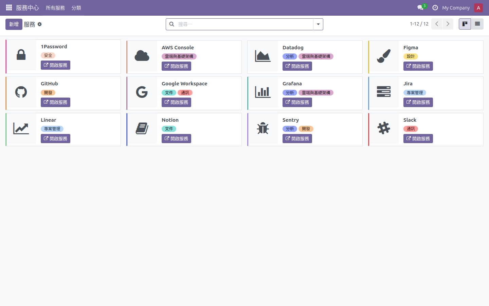
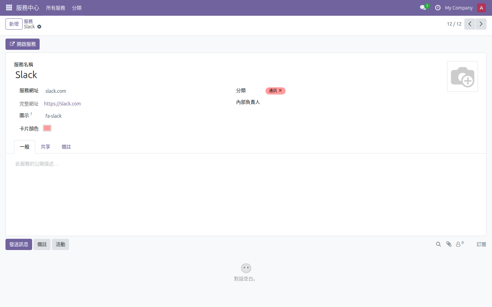
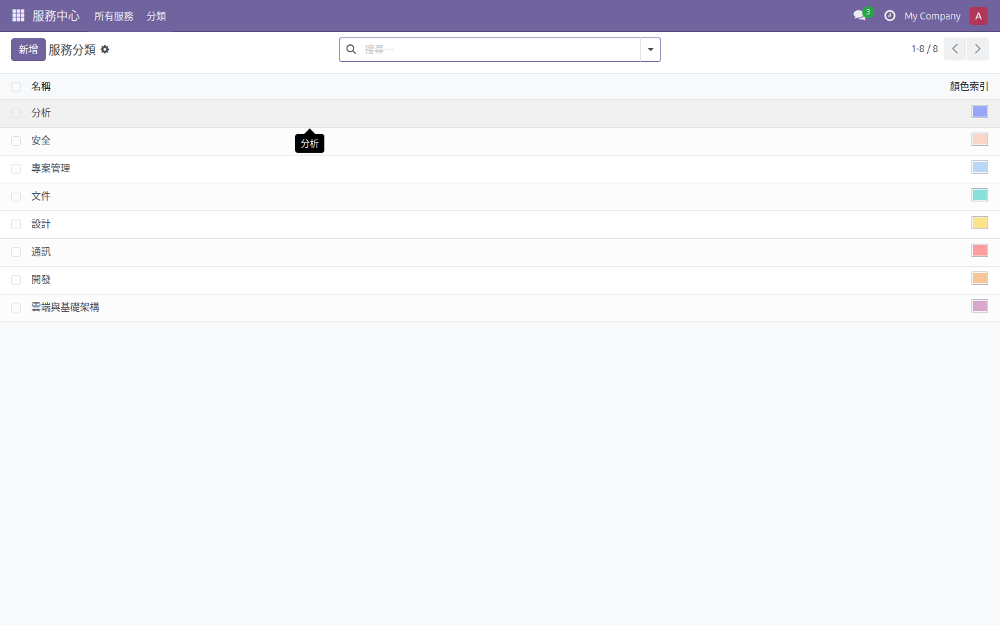
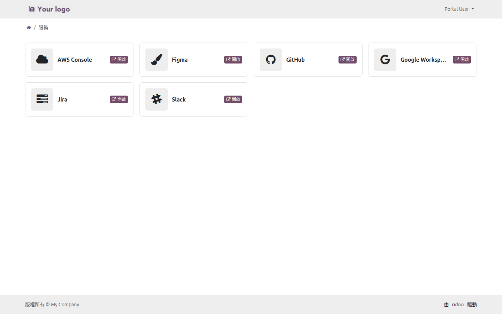
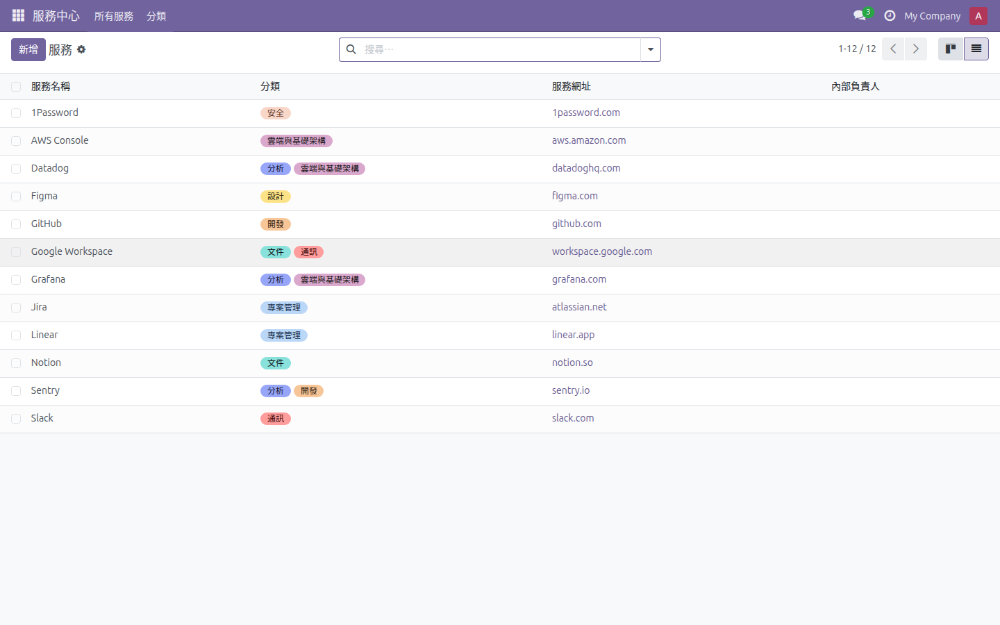
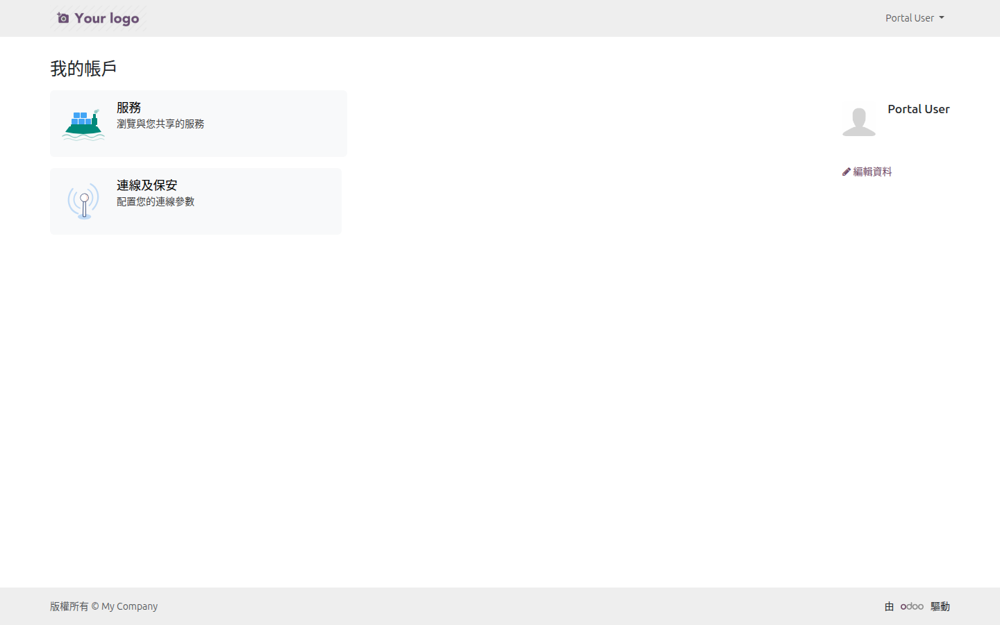
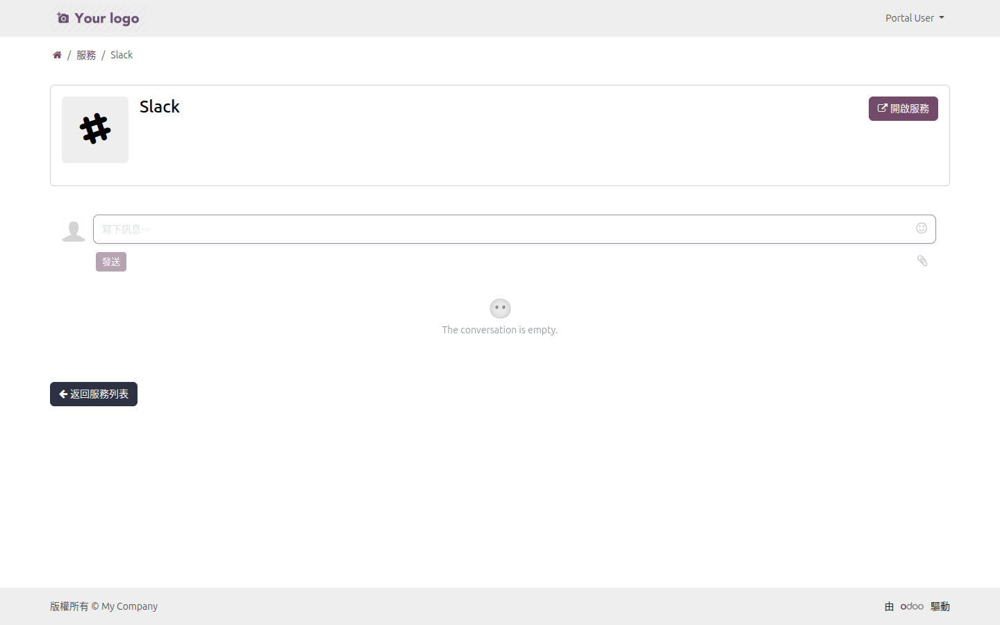

# WoowTech 服務中心 — 使用教學手冊

> **歡迎來到 WoowTech 服務中心！**
>
> 這本手冊專門為「第一次使用」的你而寫。不管你是公司的管理員、一般員工，還是外部合作夥伴，都能在這裡找到你需要的操作指南。
>
> 我們會用最白話的方式，一步一步帶你上手。準備好了嗎？讓我們開始吧！

---

## 目錄

| 章節 | 標題 | 適合誰看 |
|------|------|----------|
| [快速開始](#快速開始2-分鐘上手) | 2 分鐘快速上手 | 所有人 |
| [Part A](#part-a-管理員教學-admin) | 管理員教學 | 負責設定系統的人 |
| [Part B](#part-b-一般使用者教學-user) | 一般使用者教學 | 公司內部員工 |
| [Part C](#part-c-portal-使用者教學-external-partner) | Portal（外部夥伴專用入口）使用者教學 | 外部合作夥伴 |
| [附錄](#附錄) | 常見問題、名詞解釋、權限對照 | 需要查資料時 |

---

## 快速開始（2 分鐘上手）

### 這是什麼？

**WoowTech 服務中心**是一個幫你把公司所有常用網路服務「收集在一起」的工具。

想像一下：你公司用 Slack 聊天、用 Notion 寫文件、用 GitHub 管程式碼、用 Figma 做設計... 這些服務的網址散落在各處，每次要用都得翻書籤或問同事。

現在有了服務中心，所有服務都像一張張「名片」整整齊齊排在牆上。想用哪個？點一下就開了。就這麼簡單。

*上圖：這就是服務中心的主畫面。在畫面中央，你會看到每張彩色卡片代表一個服務（像 Slack、GitHub、Notion 等等）。注意看每張卡片右下角的「開啟服務」按鈕——點下去就會在新分頁打開那個服務。看向畫面左上角，紫色的「新增」按鈕可以加入新服務。畫面右上角有兩個小圖示，可以切換不同的檢視方式（看板或清單）。*

---

### 我想要...（快速導航）

根據你想做的事，直接跳到對應的章節：

| 我想要... | 我的角色 | 請看這裡 |
|-----------|----------|----------|
| 新增一個服務 | 管理員 | [A1. 建立你的第一個服務](#a1-第一次設定建立你的第一個服務完整教學情境) |
| 建立服務分類（像「開發工具」「設計工具」） | 管理員 | [A2. 管理分類標籤](#a2-管理分類標籤) |
| 讓外部合作夥伴也能看到某些服務 | 管理員 | [A3. 分享服務給外部合作夥伴](#a3-分享服務給外部合作夥伴) |
| 指派誰可以管理、誰只能看 | 管理員 | [A4. 管理使用者權限](#a4-管理使用者權限) |
| 瀏覽公司有哪些服務 | 一般使用者 | [B1. 瀏覽服務目錄](#b1-瀏覽服務目錄) |
| 打開某個服務來用 | 一般使用者 | [B2. 開啟服務](#b2-開啟服務) |
| 在服務下方留言問問題 | 一般使用者 | [B3. 在服務下方留言討論](#b3-在服務下方留言討論) |
| 登入 Portal（外部夥伴專用入口）看被分享的服務 | 外部夥伴 | [C1. 登入 Portal](#c1-登入-portal) |
| 找到並打開分享給我的服務 | 外部夥伴 | [C2. 瀏覽被分享的服務](#c2-瀏覽被分享的服務) |

---

### 三種使用者角色

在開始之前，先認識一下這個系統裡的三種角色：

| 角色 | 誰是這種角色？ | 可以做什麼？ |
|------|----------------|--------------|
| **管理員 (Admin)** | IT 人員、部門主管 | 新增/編輯/刪除服務、管理分類、設定分享、指派權限 — 什麼都能做 |
| **一般使用者 (User)** | 公司內部員工 | 瀏覽所有服務、開啟服務、留言討論 — 只能看不能改 |
| **Portal 使用者** | 外部合作夥伴、客戶 | 只能看到「被分享給他」的服務 — 像是訪客通行證 |

> **小提示**
>
> 不確定你是哪種角色？最簡單的判斷方式：
> - 如果你登入後看得到「新增」按鈕，而且點下去真的可以新增服務 → 你是**管理員**
> - 如果你登入後只能看服務，沒有「新增」按鈕 → 你是**一般使用者**
> - 如果你是透過特殊連結登入，只看到少少幾個服務 → 你是 **Portal 使用者**

---

### 安裝完成後的第一件事

模組安裝好了，接下來呢？

如果你是**管理員**：
1. 先建立幾個分類（像「開發工具」「溝通協作」「設計」）
2. 把公司常用的服務加進去
3. 設定好哪些服務要分享給外部夥伴

如果你是**一般使用者**：
1. 直接到服務中心看看有哪些服務
2. 找到你常用的，記住它的位置
3. 試著用「開啟服務」按鈕

如果你是 **Portal 使用者**：
1. 用收到的邀請信設定密碼
2. 登入 Portal 看看有哪些服務被分享給你
3. 有問題就用留言功能跟管理員溝通

---

## Part A: 管理員教學 (Admin)

> **你將學到**
>
> 這個章節會教你如何從零開始設定整個服務中心。包括：
> - 新增第一個服務
> - 建立分類標籤
> - 分享服務給外部夥伴
> - 管理使用者權限
> - 日常維護（封存、批次操作等）

如果你是公司裡負責管理這套系統的人，這個章節就是為你寫的。

---

### A1. 第一次設定：建立你的第一個服務（完整教學情境）

> **你將學到**
>
> 完成這個教學後，你會知道如何：
> - 新增一個服務到服務中心
> - 設定服務的名稱、網址、圖示、顏色
> - 選擇服務的分類標籤
> - 指定服務的內部負責人
> - 測試服務連結是否正常

**情境**：你是公司的 IT 管理員，老闆說要把公司常用的 Slack 加入服務中心，讓大家都能快速找到。

**完成後你會**：成功在服務中心看到一張 Slack 的卡片，點擊就能打開 Slack 網站。

---

#### 第一步：進入服務中心

1. 登入 Odoo 系統（就是你平常用的那個網址）

2. 在左邊的主選單找到 **服務中心**，點擊它

3. 再點擊子選單的 **所有服務**

現在你應該會看到服務中心的主畫面。如果公司之前已經有加過服務，你會看到一些卡片；如果是全新的系統，畫面可能是空的。

*上圖：服務中心的主畫面（看板視圖）。注意看左上角有一個紫色的「新增」按鈕，待會我們要用它來新增服務。右上角有兩個小圖示是視圖切換按鈕，可以在看板和清單之間切換。畫面中央是服務卡片區域，每張卡片左側會有一條顏色標示。*

> **你看到這個畫面了嗎？**
>
> - 如果**有**看到左上角的紫色「新增」按鈕 → 太好了，你有管理員權限，繼續下一步
> - 如果**沒有**看到「新增」按鈕 → 你可能沒有管理員權限，請聯繫系統管理員幫你開通

---

#### 第二步：點擊「新增」按鈕

1. 看到左上角紫色的 **新增** 按鈕了嗎？點擊它

2. 系統會打開一個空白的服務表單，等著你填寫資料

你現在應該會看到一個空白表單，上面有很多欄位可以填。別擔心，我們一個一個來。（參見下方表單截圖，待會填完後會長得像這樣）

*上圖：這是服務表單的樣子。在畫面最上方，你會看到一排按鈕——左邊有「儲存」按鈕，右邊有「開啟服務」按鈕。往下看，表單分成幾個區塊：最上方是「服務名稱」欄位（這是必填的），接下來是「服務網址」「完整網址」欄位。在表單左側中間位置，你會看到 Logo 上傳區（一個方形的圖片上傳框）。表單右側有「圖示」「卡片顏色」「分類」「內部負責人」等欄位。最下方則是討論區。以下步驟 3-8 都是在這個表單上操作。*

---

#### 第三步：填寫服務名稱

1. 找到 **服務名稱** 欄位（參見上方表單截圖，這是表單最上方、也是唯一「必填」的欄位，旁邊會有星號標示）

2. 輸入：`Slack`

> **小提示**
>
> 服務名稱建議用大家熟悉的稱呼。例如用「Slack」而不是「企業通訊軟體」，這樣同事一看就知道是什麼。

---

#### 第四步：設定服務網址

1. 找到 **服務網址** 欄位（參見上方表單截圖，位於服務名稱下方，是一個文字輸入框）

2. 輸入：`slack.com`

> **小提示**
>
> 你不需要輸入 `https://`！系統會自動幫你補上。所以只要輸入 `slack.com` 就好。
>
> 儲存之後，你會看到旁邊的「完整網址」欄位自動變成 `https://slack.com`。這就是系統在幫你做的事。

**常見錯誤**

> 如果你輸入的是你們公司專屬的 Slack 網址（例如 `woowtech.slack.com`），記得輸入完整的網域名稱喔！

---

#### 第五步：選擇圖示

Slack 的卡片上要顯示什麼圖案呢？你有兩個選擇：

**選項 A：上傳 Logo 圖片**
1. 找到 **Logo** 欄位（參見上方表單截圖，在表單左側中間位置，有一個方形的圖片上傳區，可能顯示為灰色佔位圖或相機圖示）
2. 點擊上傳區，選擇 Slack 的 Logo 圖片
3. 建議用正方形的圖片，大小至少 256x256 像素

**選項 B：使用內建圖示**（推薦新手使用）
1. 找到 **圖示** 欄位（參見上方表單截圖，在表單右側，是一個文字輸入框）
2. 輸入：`fa-slack`

> **這是什麼？「fa-」是什麼意思？**
>
> `fa` 是「Font Awesome」的縮寫。Font Awesome 是一個免費的網頁圖示庫，提供數千個小圖示。在 Odoo 中，你可以用這些代碼讓服務顯示對應的圖示。例如 `fa-slack` 會顯示 Slack 的標誌，`fa-github` 會顯示 GitHub 的貓咪標誌。
>
> 你不需要記住這些代碼，可以在 fontawesome.com 網站上查找你需要的圖示，然後把代碼複製過來就好。
>
> 常用的代碼舉例：
> - `fa-slack` → Slack 的 logo
> - `fa-github` → GitHub 的 logo
> - `fa-rocket` → 火箭圖示
> - `fa-cloud` → 雲朵圖示
>
> 更多圖示可以在 [附錄 E: 服務圖示代碼速查表](#附錄-e-服務圖示代碼速查表) 找到。

---

#### 第六步：選擇卡片顏色

1. 找到 **卡片顏色** 欄位（參見上方表單截圖，在表單右側，圖示欄位下方，是一個下拉選單）

2. 點擊它，會出現一排顏色可以選

3. 選一個你喜歡的顏色（Slack 可以選紫色，跟它的品牌色相近）

這個顏色會顯示在看板卡片的左邊，作為視覺識別。

---

#### 第七步：選擇分類標籤

1. 找到 **分類** 欄位（參見上方表單截圖，在表單右側，卡片顏色下方，是一個可多選的下拉選單）

2. 點擊它，會出現現有的分類清單

3. 選擇 **通訊** 分類

> **小提示**
>
> 一個服務可以同時屬於多個分類！就像給照片加多個 hashtag 一樣。例如 Slack 可以同時是「通訊」和「協作」。

**如果沒有看到合適的分類怎麼辦？**

你可以直接在欄位裡輸入新的分類名稱，然後選擇「建立」。但更好的做法是先到分類管理頁面統一規劃（請看 [A2. 管理分類標籤](#a2-管理分類標籤)）。

---

#### 第八步：指定內部負責人（選填）

1. 找到 **內部負責人** 欄位（參見上方表單截圖，在表單右側，分類欄位下方，是一個可搜尋的下拉選單）

2. 點擊它，搜尋並選擇負責這個服務的員工

> **這是什麼用途？**
>
> 當有人對 Slack 這個服務有問題時，可以知道該找誰。例如：「Slack 連不上了！」→ 找內部負責人。

---

#### 第九步：儲存！

1. 檢查一下剛才填的資料

2. 點擊左上角的 **儲存** 按鈕（參見上方表單截圖，位於表單最上方左側，是一個明顯的按鈕），或按鍵盤的 Ctrl+S

恭喜！你剛剛建立了第一個服務！

---

#### 第十步：測試一下

現在來確認服務是否設定正確：

1. 在剛才建立的 Slack 服務表單上方，找到 **開啟服務** 按鈕（參見上方表單截圖，位於表單最上方右側，「儲存」按鈕的旁邊）

2. 點擊它

3. 系統應該會在新分頁打開 Slack 的網站

*上圖：Slack 服務的表單視圖。注意看畫面最上方有一排按鈕：左側是「儲存」，右側是「開啟服務」按鈕（通常是藍色或紫色的連結按鈕）——點擊就會在新分頁打開服務網站。往下捲動到畫面最下方，你會看到討論區（討論區）可以留言。*

**你成功了嗎？**

- 如果成功打開 Slack 網站 → 恭喜！設定完成了
- 如果打不開 → 檢查一下「服務網址」欄位是不是打錯字了

---

#### 第十一步：回到看板確認

1. 點擊瀏覽器的上一頁，或從選單重新進入 **服務中心** > **所有服務**

2. 你應該會看到剛才建立的 Slack 卡片出現在看板上

3. 卡片上應該顯示：
   - Slack 的圖示或 Logo
   - 服務名稱「Slack」
   - 你選的分類標籤（例如「通訊」，帶有顏色）
   - 「開啟服務」按鈕

**大功告成！**

你已經成功建立了第一個服務。用同樣的方法，可以把公司所有常用的服務都加進來。

---

#### 延伸練習：再加幾個服務試試看

現在你已經會建立服務了，試著把以下常用服務也加進去：

| 服務 | 建議網址 | 建議圖示 | 建議分類 |
|------|----------|----------|----------|
| GitHub | `github.com` | `fa-github` | 開發 |
| Notion | `notion.so` | `fa-book` | 文件 |
| Figma | `figma.com` | `fa-figma` | 設計 |
| Google Workspace | `workspace.google.com` | `fa-google` | 生產力 |
| AWS Console | `aws.amazon.com` | `fa-aws` | 雲端與基礎架構 |
| Jira | `atlassian.net` | `fa-jira` | 專案管理 |

> **小提示：關於圖示代碼**
>
> 上表中的圖示代碼（如 `fa-github`、`fa-figma`）都是 Font Awesome 圖示庫的代碼。`fa-` 開頭表示這是 Font Awesome 圖示。你可以在 fontawesome.com 網站搜尋更多圖示。

每加一個服務，你就會更熟練。很快你就能在一分鐘內完成一個服務的建立！

---

> **小提示：讓看板更整齊的秘訣**
>
> 1. **統一命名風格**：例如都用英文名稱（Slack、Notion），或都用中文（即時通訊、筆記工具）
> 2. **善用分類**：把相關的服務歸在同一個分類，方便同事找
> 3. **選對顏色**：可以讓同分類的服務用相近的顏色，一眼就能識別

---

### A2. 管理分類標籤

> **你將學到**
>
> 完成這個章節後，你會知道如何：
> - 建立新的分類標籤
> - 編輯現有分類的名稱和顏色
> - 刪除不需要的分類

**分類是什麼？**

分類就像資料夾標籤，幫你把服務組織起來。例如：
- **開發** → GitHub、GitLab、Sentry
- **設計** → Figma、Adobe XD、Sketch
- **通訊** → Slack、Microsoft Teams、Zoom
- **文件** → Notion、Confluence、Google Docs

有了分類，同事就能快速找到需要的服務。

---

#### 查看現有分類

1. 在主選單點擊 **服務中心**

2. 點擊子選單的 **分類**

你會看到分類列表，顯示每個分類的名稱和顏色。

*上圖：分類管理畫面。在畫面中央，你會看到一個清單，列出所有現有的分類。每個分類名稱左邊有一個彩色圓點或色塊，代表該分類的顏色。例如你可能看到「開發」旁邊是綠色、「設計」旁邊是粉紅色、「通訊」旁邊是藍色。畫面左上角同樣有紫色的「新增」按鈕可以建立新分類。*

---

#### 建立新分類

**情境**：公司開始使用 AI 工具了，你想建立一個「AI 工具」的分類。

**完成後你會**：在分類清單中看到「AI 工具」，之後新增服務時就能選擇這個分類。

1. 點擊左上角的 **新增** 按鈕

2. 在 **分類名稱** 欄位輸入：`AI 工具`

3. 在 **色彩** 欄位選擇一個顏色（建議選一個還沒被其他分類用過的）

4. 點擊 **儲存**

完成！現在你在新增服務時，就能選擇「AI 工具」這個分類了。

---

#### 編輯分類

1. 在分類列表中，點擊你想編輯的分類

2. 修改名稱或顏色

3. 點擊 **儲存**

> **小提示**
>
> 修改分類名稱後，所有使用這個分類的服務都會自動更新顯示。

---

#### 刪除分類

1. 在分類列表中，勾選你想刪除的分類（名稱左邊的勾選框）

2. 點擊上方的 **動作** 按鈕

3. 選擇 **刪除**

4. 在確認對話框中點擊 **確定**

> **常見錯誤**
>
> 刪除分類**不會**連帶刪除服務！服務還在，只是變成「沒有分類」而已。
>
> 但如果這個分類下有很多服務，刪除後會變得很難找。建議刪除前先把服務移到其他分類。

---

#### 分類規劃建議

| 分類方式 | 範例 | 適合情況 |
|----------|------|----------|
| **按功能分** | 開發、設計、行銷、財務 | 公司部門分工明確 |
| **按用途分** | 溝通、文件、專案管理 | 服務類型多元 |
| **按重要性分** | 核心系統、輔助工具 | 需要強調優先順序 |

> **小提示**
>
> 分類不要太細！5-10 個分類通常就夠用了。分類太多反而讓人眼花撩亂。

---

#### 情境練習：建立完整的分類系統

**任務**：假設你們公司使用以下這些服務，請設計一套分類系統。

**完成後你會**：擁有一套 7 個分類的組織架構，讓同事能快速找到各類服務。

服務清單：
- Slack（聊天）
- Zoom（視訊會議）
- GitHub（程式碼）
- Sentry（錯誤追蹤）
- Figma（UI 設計）
- Notion（文件）
- Jira（專案管理）
- AWS（雲端主機）
- 1Password（密碼管理）

**參考答案**：

| 分類 | 包含服務 | 建議顏色 |
|------|----------|----------|
| 通訊 | Slack、Zoom | 藍色 |
| 開發 | GitHub、Sentry | 綠色 |
| 設計 | Figma | 粉紅色 |
| 文件 | Notion | 橘色 |
| 專案管理 | Jira | 紫色 |
| 雲端與基礎架構 | AWS | 黃色 |
| 安全 | 1Password | 紅色 |

這樣分類清晰，同事一看就知道去哪裡找需要的服務。

---

### A3. 分享服務給外部合作夥伴

> **你將學到**
>
> 完成這個章節後，你會知道如何：
> - 建立一個 Portal 使用者帳號
> - 把特定服務分享給外部合作夥伴
> - 驗證對方確實能看到被分享的服務

**什麼是 Portal（外部夥伴專用入口）？**

Portal 就像「訪客通行證」。外部合作夥伴（例如客戶、廠商、外包人員）可以透過 Portal 登入系統，但只能看到你特別分享給他們的內容。

**情境**：你們公司跟一家設計公司合作，對方需要存取你們的 Figma 和 Slack 進行溝通協作。

**完成後你會**：外部設計師可以透過 Portal 登入，看到 Figma 和 Slack 兩個服務，點擊就能開啟。

---

#### 第一步：確認聯絡人已建立

首先，確保這位外部夥伴已經在系統裡有聯絡人資料。

1. 在主選單找到 **聯絡人** 模組，點擊進入

2. 搜尋這位外部夥伴的名稱或公司名

3. **如果找到了** → 記住這個聯絡人，繼續下一步

4. **如果沒找到** → 點擊「新增」建立新聯絡人，填寫姓名和 Email（Email 必填！）

---

#### 第二步：授予 Portal 存取權限

現在要讓這位聯絡人可以登入 Portal。

1. 打開這位聯絡人的詳細資料頁面

2. 點擊上方的 **動作** 按鈕

3. 選擇 **授予 Portal 存取權限**

4. 確認 Email 地址正確，點擊 **確定**

系統會自動寄送一封邀請信給對方，信裡有設定密碼的連結。

> **小提示**
>
> 請提醒對方去收信！有時候邀請信會跑到垃圾郵件匣。

---

#### 第三步：把服務分享給這位夥伴

現在來設定要分享哪些服務。

1. 回到 **服務中心** > **所有服務**

2. 找到你想分享的服務（例如 Slack），點擊打開

3. 在服務表單中，找到 **共享** 頁籤（或「分享對象」欄位）

4. 在 **分享對象** 欄位中，搜尋並選擇剛才那位外部夥伴的名稱

5. 點擊 **儲存**

用同樣的方式，把其他需要分享的服務（例如 Figma）也加上這位夥伴。

> **小提示**
>
> 可以一次分享多個服務！在「分享對象」欄位加入同一個人後，他就能看到這些服務了。

---

#### 第四步：驗證設定是否成功

怎麼確認對方真的能看到？你可以：

**方法 A：用無痕視窗測試**

1. 打開瀏覽器的無痕視窗（Chrome 按 Ctrl+Shift+N）

2. 輸入你的 Odoo 網址，後面加上 `/my`（例如 `https://yourcompany.odoo.com/my`）

3. 用那位外部夥伴的帳號登入

4. 看看他能不能看到被分享的服務

**方法 B：請對方確認**

請對方登入後截圖給你看，確認他看到的服務是正確的。

*上圖：外部夥伴登入 Portal 後看到的畫面。在畫面中央，你會看到服務卡片牆——只會顯示被分享給他的服務，其他公司內部的服務他完全看不到。每張卡片上有服務圖示、服務名稱，以及右下角的「開啟」按鈕。如果只分享了 2 個服務，這裡就只會出現 2 張卡片。*

---

> **常見錯誤**
>
> **問題**：外部夥伴說他看不到任何服務
>
> **檢查清單**：
> 1. 服務的「分享對象」欄位有沒有加入他？
> 2. 他登入的帳號對不對？（是不是用錯 Email）
> 3. 服務有沒有被封存？（封存的服務不會顯示）

---

#### 完整情境演練：外包設計師協作

**情境**：你們公司聘請了一位外包設計師小美，她需要存取 Figma 和 Slack 跟你們團隊協作。

**完成後你會**：小美可以透過 Portal 看到 Figma 和 Slack，點擊就能開啟。如果她有問題，可以在服務下方留言，你會收到通知。

**步驟總覽**：

| 步驟 | 做什麼 | 在哪裡做 |
|------|--------|----------|
| 1 | 建立小美的聯絡人 | 聯絡人模組 |
| 2 | 授予 Portal 權限 | 聯絡人 > 動作 |
| 3 | 分享 Figma 給小美 | 服務中心 > Figma 服務 |
| 4 | 分享 Slack 給小美 | 服務中心 > Slack 服務 |
| 5 | 提醒小美收信設定密碼 | Email 或訊息 |
| 6 | 驗證小美能看到服務 | 請小美截圖確認 |

---

### A4. 管理使用者權限

> **你將學到**
>
> 完成這個章節後，你會知道如何：
> - 了解三種權限等級的差異
> - 把一般使用者升級為管理員
> - 降低某人的權限

---

#### 權限等級說明

| 權限等級 | 可以做什麼 | 不能做什麼 |
|----------|------------|------------|
| **管理員 (Admin)** | 新增服務、編輯服務、刪除服務、管理分類、設定分享 | 無限制 |
| **使用者 (User)** | 瀏覽服務、開啟服務、留言討論 | 不能新增/編輯/刪除服務 |
| **Portal** | 只能看被分享的服務、留言 | 不能看後台、不能看未分享的服務 |

---

#### 如何變更使用者權限

**情境**：你想讓小明從「一般使用者」變成「管理員」，讓他也能幫忙管理服務中心。

**完成後你會**：小明重新登入後，會看到「新增」按鈕，可以新增和編輯服務。

1. 在主選單點擊 **設定**（齒輪圖示）

2. 點擊 **使用者與公司** > **使用者**

3. 搜尋並點擊「小明」

4. 往下捲動，找到 **存取權限** 區塊

5. 找到 **服務中心** 這一項

6. 把下拉選單從「使用者」改成「管理員」

7. 點擊 **儲存**

小明重新登入後，就會有管理員權限了。

---

> **小提示**
>
> 權限遵循「大權包含小權」原則。管理員自動擁有使用者的所有權限，使用者自動擁有基本瀏覽權限。

---

> **常見錯誤**
>
> **問題**：我找不到「服務中心」的權限設定
>
> **解法**：
> 1. 確認你已經開啟「開發者模式」（設定 > 一般設定 > 最下方「開發者模式」）
> 2. 如果還是沒有，可能是模組沒有正確安裝，請聯繫技術人員

---

#### 權限設定最佳實務

| 角色 | 應該給誰 | 為什麼 |
|------|----------|--------|
| **管理員** | IT 部門、部門主管 | 需要新增/編輯服務的人 |
| **使用者** | 一般員工 | 只需要瀏覽和使用服務 |
| **Portal** | 外部合作夥伴 | 不是公司員工，只看特定服務 |

> **小提示**
>
> 權限給得越少越安全。如果一個人只需要「看」服務，就不要給他管理員權限。這樣可以避免誤操作。

---

### A5. 日常維護

> **你將學到**
>
> 完成這個章節後，你會知道如何：
> - 封存（隱藏）不再使用的服務
> - 恢復被封存的服務
> - 批次操作多個服務

---

#### 封存服務（暫時隱藏）

公司不再使用某個服務了，但又不想直接刪除？可以「封存」它。

**情境**：公司決定停用 Trello，改用 Linear。Trello 先封存起來，萬一以後又要用還可以恢復。

**完成後你會**：Trello 不會出現在服務列表中，但資料都保留著，隨時可以恢復。

**單一封存**

1. 打開 Trello 的服務表單

2. 找到右上角的 **動作** 按鈕（三個點）

3. 選擇 **封存**

封存後，服務不會出現在一般的清單中，但資料都還在。

**批次封存**

1. 切換到清單視圖（點擊右上角的清單圖示）

2. 勾選所有要封存的服務

3. 點擊上方的 **動作** > **封存**

*上圖：清單視圖適合做批次操作。在畫面中央你會看到一個表格，每一列代表一個服務。注意看每列最左邊有一個勾選框——可以一次勾選多個服務。勾選後，畫面上方會出現「動作」按鈕，點擊可以選擇「封存」「刪除」等操作。表格的欄位顯示服務名稱、分類、網址等資訊，點擊欄位標題可以排序。*

---

#### 恢復封存的服務

過了一年，公司決定重新啟用 Trello。怎麼把它找回來？

**完成後你會**：Trello 重新出現在服務列表中，跟其他服務一樣可以使用。

1. 在搜尋列旁邊，點擊 **篩選** 按鈕

2. 在篩選器中，選擇 **已封存**（這個選項會顯示所有被隱藏的服務）

3. 找到 Trello，點擊打開

4. 點擊 **動作** > **取消封存**

服務就恢復了，會重新出現在正常的清單中。

---

#### 刪除服務（永久移除）

> **常見錯誤**
>
> 刪除是**永久**的！一旦刪除，相關的討論記錄也會一起消失。
>
> 如果只是暫時不用，請用「封存」而不是「刪除」。

確定要刪除？

1. 打開要刪除的服務表單

2. 點擊 **動作** > **刪除**

3. 在確認對話框點擊 **確定**

---

#### 批次操作技巧

清單視圖是做批次操作的好地方。你可以：

| 操作 | 怎麼做 |
|------|--------|
| 批次封存 | 勾選多個服務 > 動作 > 封存 |
| 批次刪除 | 勾選多個服務 > 動作 > 刪除 |
| 批次修改分類 | 勾選多個服務 > 動作 > 更新 > 選擇分類 |
| 匯出資料 | 勾選服務 > 動作 > 匯出 |

---

#### 維護檢查清單

建議每個月做一次以下檢查：

- [ ] 確認所有服務的網址還能正常開啟
- [ ] 檢查是否有新服務需要加入
- [ ] 確認分類還符合現況
- [ ] 檢查 Portal 使用者的分享設定是否還正確（有人離職了嗎？）
- [ ] 清理不再使用的服務（封存或刪除）

> **小提示**
>
> 把這個清單加到你的行事曆，設定每月提醒！

---

## Part B: 一般使用者教學 (User)

> **你將學到**
>
> 這個章節會教你如何使用服務中心找到需要的服務、快速開啟它，以及留言跟同事討論。
>
> 如果你是公司的一般員工，這個章節就是為你寫的。

作為一般使用者，你不需要管理服務，只需要知道怎麼「找到」和「使用」它們。很簡單的，跟著做就對了！

---

### B1. 瀏覽服務目錄

> **你將學到**
>
> 完成這個章節後，你會知道如何：
> - 找到服務中心
> - 切換看板和清單視圖
> - 用搜尋和篩選找到特定服務

---

#### 進入服務中心

1. 登入 Odoo 系統

2. 在左邊的主選單找到 **服務中心**，點擊它

3. 點擊 **所有服務**

你現在應該看到服務中心的主畫面了。

---

#### 認識看板視圖

預設會顯示「看板視圖」，每個服務都是一張卡片。

*上圖：看板視圖——在畫面中央，每張卡片代表一個服務。仔細看卡片的組成：左側有一條顏色標示（代表分類顏色），中間顯示服務圖示和名稱，下方有彩色的分類標籤，右下角是「開啟服務」按鈕。點擊這個按鈕可以直接打開服務網站。*

**卡片上有什麼？**

| 元素 | 說明 |
|------|------|
| 圖示/Logo | 服務的視覺識別 |
| 服務名稱 | 例如「Slack」「GitHub」 |
| 分類標籤 | 彩色小標籤，表示這個服務屬於哪個類別 |
| 開啟服務按鈕 | 點擊直接打開服務網站 |

---

#### 切換到清單視圖

如果服務很多，清單視圖可能更好用。

1. 看到右上角的視圖切換按鈕了嗎？有兩個小圖示

2. 點擊「清單」圖示（看起來像幾條橫線）

*上圖：清單視圖——用表格方式顯示所有服務。在畫面中央你會看到一個表格，每一列是一個服務。從左到右的欄位依序是：勾選框、服務名稱、分類、網址、內部負責人等資訊。點擊任何欄位標題（如「服務名稱」）可以按該欄位排序。*

清單視圖的好處是可以一眼看到更多服務，而且可以點擊欄位標題排序。

---

#### 搜尋服務

服務太多找不到？用搜尋功能！

1. 看到畫面上方的搜尋框了嗎？

2. 直接輸入服務名稱，例如 `Slack`

3. 按 Enter，畫面會只顯示符合的服務

---

#### 用篩選找服務

想看某一類的服務？用篩選！

1. 點擊搜尋框旁邊的 **篩選** 按鈕

2. 選擇 **分類**

3. 選擇你要的分類（例如「開發」）

畫面會只顯示屬於「開發」分類的服務。

---

#### 用群組方式檢視

想把服務按分類分組顯示？

1. 點擊 **群組依據**

2. 選擇 **分類**

現在服務會按分類分組，每個分類一個區塊，超整齊！

---

> **小提示**
>
> 找到常用的服務後，可以把這個頁面加到瀏覽器書籤，下次直接點書籤就能進來。

---

### B2. 開啟服務

> **你將學到**
>
> 完成這個章節後，你會知道如何：
> - 用最快的方式開啟服務
> - 理解「開啟服務」按鈕的作用

開啟服務超級簡單，只要一個動作。

---

#### 方法一：直接在卡片上點擊（推薦）

1. 在看板視圖找到你要的服務

2. 點擊卡片上的 **開啟服務** 按鈕

3. 服務網站會在「新分頁」打開

就這樣，一秒完成！

---

#### 方法二：從服務詳情頁開啟

1. 點擊服務卡片（點名稱或圖示的部分，不是按鈕）

2. 進入服務的詳細資料頁面

3. 在頁面上方找到 **開啟服務** 按鈕

4. 點擊它，網站會在新分頁打開

*上圖：服務的詳細資料頁面。注意看畫面最上方有一排按鈕，其中「開啟服務」按鈕通常在右側，是一個藍色或紫色的連結按鈕。這裡還可以看到更多資訊，像是服務網址（在表單中間）、分類和內部負責人（在表單右側）等。往下捲動可以看到討論區。*

---

> **小提示**
>
> 「開啟服務」永遠會在「新分頁」打開，不會蓋掉你現在的畫面。所以放心點，不會迷路！

---

> **常見錯誤**
>
> **問題**：點了「開啟服務」但網站打不開
>
> **可能原因**：
> 1. 瀏覽器擋住了彈出視窗 → 檢查網址列是否有「彈出視窗被阻擋」的提示
> 2. 網址設定錯了 → 跟管理員回報這個問題

---

### B3. 在服務下方留言討論

> **你將學到**
>
> 完成這個章節後，你會知道如何：
> - 在服務下方留言問問題
> - 回覆別人的留言
> - 追蹤服務的更新

每個服務都有自己的「討論區」(Chatter)，你可以在那裡留言、問問題、跟同事討論。在本手冊中，我們統一稱它為「討論區」。

---

#### 認識討論區

1. 打開任何一個服務的詳細資料頁面

2. 往下捲動，會看到討論區

*上圖：服務表單下方有討論區。往下捲動到表單最下方，你會看到三個按鈕並排：「發送訊息」「備註」「活動」。下方則是歷史留言區域，會顯示之前的對話記錄，每則留言都標有發送者的頭像和名字、發送時間。*

討論區有三個功能：

| 功能 | 用途 |
|------|------|
| **發送訊息** | 發給所有追蹤這個服務的人（會寄 Email 通知） |
| **備註** | 只記錄在系統裡，不寄通知 |
| **活動** | 建立待辦事項，可以指派給特定人 |

---

#### 發送訊息

**情境**：你發現 Slack 連不上，想問大家是不是只有你這樣。

1. 打開 Slack 的服務詳情頁面

2. 點擊 **發送訊息** 按鈕

3. 在輸入框輸入你的訊息：「大家好，請問現在 Slack 連得上嗎？我這邊一直轉圈圈。」

4. 點擊 **發送**

訊息就發出去了！所有追蹤這個服務的人都會收到 Email 通知。

---

#### 回覆留言

有人在討論區留言了，你想回覆？

1. 找到那則留言

2. 點擊留言下方的 **回覆** 按鈕

3. 輸入你的回覆

4. 點擊 **發送**

---

#### 追蹤服務

如果你想收到某個服務的所有更新通知：

1. 打開服務詳情頁面

2. 在討論區上方找到 **追蹤** 按鈕

3. 點擊它

之後這個服務有任何新留言，你都會收到 Email 通知。

---

> **小提示**
>
> 討論區就像每個服務專屬的 LINE 群組。關於這個服務的問題、公告、討論，都可以放在這裡，方便以後查詢。

---

#### 情境範例：回報 Slack 無法連線

**情境**：你發現 Slack 從早上就連不上，想問問是不是公司的問題。

**完成後你會**：你的問題會被記錄在 Slack 服務的討論區，所有追蹤者（包括 IT 管理員）都會收到通知。通常會在幾分鐘到幾小時內收到回覆。

**步驟**：

1. 打開服務中心，找到 Slack

2. 點擊 Slack 卡片，進入詳情頁面

3. 往下捲動到討論區

4. 點擊 **發送訊息**

5. 輸入：「各位好，我從早上 9 點開始就連不上 Slack，一直顯示『無法連線』。請問是只有我這樣嗎？還是公司網路有問題？」

6. 點擊 **發送**

**結果**：所有追蹤 Slack 的人（包括 IT 管理員）都會收到你的訊息。如果是公司整體的問題，IT 可以在下方回覆說明狀況。

這樣做的好處是：
- 問題記錄在服務中心，以後還能查
- 不用到處問人，直接在服務下方討論
- 其他有同樣問題的人也能看到解答

---

## Part C: Portal 使用者教學 (External Partner)

> **你將學到**
>
> 這個章節會教你如何以外部合作夥伴的身份登入 Portal（外部夥伴專用入口），瀏覽被分享給你的服務，以及跟對方公司的人溝通。
>
> 如果你是合作廠商、外包人員、客戶，這個章節就是為你寫的。

---

### 什麼是 Portal？

Portal 就像「訪客入口」。你不是這家公司的員工，但他們想讓你使用某些服務或資源，所以給你一個特別的帳號。

這個帳號只能看到「被分享給你」的內容，其他公司內部的東西你是看不到的。

---

### C1. 登入 Portal

> **你將學到**
>
> 完成這個章節後，你會知道如何：
> - 收到邀請信後怎麼設定密碼
> - 登入 Portal 入口
> - 找到服務中心的入口

---

#### 第一步：收邀請信

當對方公司把你加入 Portal 後，你會收到一封 Email，標題類似「邀請您加入 XXX 的 Portal」。

信裡會有一個連結，點擊它可以設定你的密碼。

> **小提示**
>
> 找不到信？檢查一下「垃圾郵件」資料夾，有時候會跑進去。

---

#### 第二步：設定密碼

1. 點擊 Email 裡的連結

2. 會跳出一個設定密碼的頁面

3. 輸入你想要的密碼（要記得！）

4. 點擊確認

> **小提示**
>
> 密碼設定頁面的畫面很直覺，只要按照頁面上的指示設定你的新密碼即可。通常會要求輸入兩次密碼以確認無誤。

---

#### 第三步：登入 Portal

1. 打開對方給你的 Portal 網址（通常是 `https://他們公司.odoo.com/my`）

2. 輸入你的 Email 和密碼

3. 點擊 **登入**

你現在應該會看到 Portal 的首頁了！

---

#### 找到服務中心入口

登入後，你會看到一個簡潔的首頁，上面有幾個方塊入口。

*上圖：Portal 首頁。在畫面中央，你會看到幾個方塊入口，每個方塊代表一個功能區域。找到「服務」這個方塊——它的右上角通常有個小數字，表示有幾個服務被分享給你。例如顯示「2」表示有 2 個服務可以使用。點擊這個方塊就能進入服務列表。*

找到 **服務** 這個入口，點擊進去。

---

### C2. 瀏覽被分享的服務

> **你將學到**
>
> 完成這個章節後，你會知道如何：
> - 瀏覽所有分享給你的服務
> - 看懂服務卡片上的資訊
> - 找到特定服務

---

#### 進入服務列表

1. 在 Portal 首頁點擊 **服務** 入口

2. 你會看到一個服務卡片牆，顯示所有被分享給你的服務

*上圖：Portal 服務清單頁面。在畫面中央，你會看到服務卡片排列成網格狀。每張卡片的構成是：上方有服務圖示（可能是品牌 Logo 或圖標），中間顯示服務名稱（如「Slack」「Figma」），下方有一個明顯的「開啟」按鈕。如果服務數量較少，可能只有 1-3 張卡片；如果較多則會自動排列成多列。*

---

#### 每張卡片有什麼？

| 元素 | 說明 |
|------|------|
| 服務圖示 | 幫助你快速識別是哪個服務 |
| 服務名稱 | 例如「Slack」「Figma」 |
| 開啟按鈕 | 點擊直接打開服務網站 |

---

> **小提示**
>
> 你只會看到「對方分享給你」的服務。如果你需要存取其他服務，請聯繫對方公司的管理員，請他幫你開通。

---

### C3. 開啟服務

> **你將學到**
>
> 完成這個章節後，你會知道如何：
> - 用最快的方式開啟服務
> - 查看服務的詳細資訊

---

#### 方法一：直接點「開啟」按鈕

這是最快的方法！

1. 在服務列表找到你要的服務

2. 點擊卡片上的 **開啟** 按鈕

3. 服務網站會在新分頁打開

---

#### 方法二：先看詳情再開啟

想先看看服務的更多資訊？

1. 點擊服務卡片（點名稱或圖示的部分）

2. 進入服務的詳情頁面

3. 在這裡你可以看到更多資訊

4. 點擊 **開啟服務** 按鈕

*上圖：Portal 服務詳情頁面。在畫面上方，你會看到服務名稱和「開啟服務」按鈕（通常是藍色或綠色的醒目按鈕）。畫面中央顯示服務的完整資訊，包括服務網址、分類等。往下捲動到畫面下方，你會看到討論區，可以在這裡留言提問。注意看畫面右上角有「返回服務列表」連結，點擊可以回到上一頁。*

---

### C4. 與管理員溝通

> **你將學到**
>
> 完成這個章節後，你會知道如何：
> - 在服務頁面留言問問題
> - 等待對方回覆
> - 追蹤討論串

在 Portal 的服務詳情頁面下方，也有討論區可以讓你留言。這是跟對方公司溝通的主要管道。

---

#### 留言提問

**情境**：你登入分享給你的 Slack 連結，但需要某個特定的頻道權限。

**完成後你會**：你的請求會被記錄下來，對方公司的管理員會收到通知並處理你的需求。

1. 打開 Slack 的服務詳情頁面

2. 往下捲動，找到討論區（留言區）

3. 在輸入框輸入你的訊息：「你好，請問可以幫我開通 #design-review 頻道的權限嗎？謝謝！」

4. 點擊 **發送**

你的訊息就發出去了！對方公司的管理員會收到通知。

---

#### 等待回覆

對方回覆後，你會收到 Email 通知。你也可以直接回到這個服務詳情頁面查看回覆。

---

> **小提示**
>
> 留言功能很適合用來：
> - 請求權限
> - 回報問題
> - 詢問使用方式
> - 確認資訊
>
> 所有對話都會被記錄下來，方便以後查閱。

---

#### 返回服務列表

看完詳情想回去？

點擊頁面右上角的 **返回服務列表** 按鈕，就會回到服務卡片牆。

---

### Portal 使用者常見情境

#### 情境一：需要額外服務的存取權

**問題**：你目前只能看到 Slack 和 Figma，但工作上也需要用到 Notion。

**完成後你會**：對方公司會收到你的請求，處理後你就能在 Portal 看到 Notion 了。

**解法**：

1. 打開任何一個你能看到的服務（例如 Slack）

2. 往下捲動到討論區

3. 點擊 **發送訊息**

4. 輸入：「你好，因為工作需要，請問可以幫我開通 Notion 的存取權限嗎？謝謝！」

5. 點擊 **發送**

對方公司的管理員收到後，會幫你加到 Notion 的分享對象中。加好後，你重新整理頁面就能看到 Notion 了。

---

#### 情境二：忘記密碼

**問題**：你忘記 Portal 的登入密碼了。

**完成後你會**：成功重設密碼並登入 Portal。

**解法**：

1. 到登入頁面

2. 點擊 **忘記密碼？** 連結

3. 輸入你的 Email

4. 去收信，點擊重設密碼的連結

5. 設定新密碼

如果還是有問題，請直接聯繫對方公司的管理員。

---

#### 情境三：服務連結失效

**問題**：你點擊「開啟服務」，但網站打不開或顯示錯誤。

**完成後你會**：管理員會收到你的回報並修正問題。

**解法**：

1. 打開那個服務的詳情頁面

2. 在討論區留言說明問題：「你好，我點擊 Figma 的開啟服務按鈕，出現 404 錯誤。請問網址是不是需要更新？」

3. 等待管理員回覆或修正

---

## 附錄

### 附錄 A: 常見問題 (FAQ)

這裡整理了使用者最常遇到的問題，用「症狀 → 原因 → 解法」的格式說明。

---

#### Q1：我登入後看不到「服務中心」選單

**症狀**：主選單上沒有「服務中心」這個項目

**原因**：你的帳號沒有被指派服務中心的權限

**解法**：
1. 請聯繫系統管理員
2. 請他到 **設定** > **使用者** > 找到你的帳號
3. 在「存取權限」區塊的「服務中心」選項，選擇「使用者」或「管理員」
4. 儲存後，你重新登入就能看到了

---

#### Q2：我是管理員但看不到「新增」按鈕

**症狀**：進入服務中心後，左上角沒有紫色的「新增」按鈕

**原因**：你的帳號權限是「使用者」而不是「管理員」

**解法**：
1. 請系統管理員把你的服務中心權限改成「管理員」
2. 重新登入後就會看到「新增」按鈕了

---

#### Q3：Portal 使用者說他看不到任何服務

**症狀**：外部夥伴登入 Portal 後，服務清單是空的

**原因**：沒有任何服務被分享給他

**解法**：
1. 打開你想分享的服務
2. 在「分享對象」欄位加入這位外部夥伴
3. 儲存
4. 請他重新整理頁面

**補充檢查**：
- 確認他登入的帳號是正確的（Email 有沒有打錯）
- 確認服務沒有被封存（封存的服務不會顯示）

---

#### Q4：點「開啟服務」但網站打不開

**症狀**：點擊後沒反應，或出現錯誤頁面

**原因 1**：瀏覽器阻擋了彈出視窗

**解法 1**：
1. 看網址列有沒有「彈出視窗被阻擋」的提示
2. 點擊允許
3. 再試一次

**原因 2**：網址設定錯誤

**解法 2**：
1. 打開服務表單
2. 檢查「服務網址」欄位是否正確
3. 常見錯誤：少打字母、多空格、少了 `.com`

---

#### Q5：上傳的 Logo 模糊不清

**症狀**：看板卡片上的 Logo 很模糊

**原因**：上傳的圖片太小

**解法**：
1. 準備一張至少 256x256 像素的正方形圖片
2. 建議用 PNG 格式
3. 重新上傳

---

#### Q6：怎麼找回被封存的服務？

**症狀**：之前有一個服務現在不見了

**原因**：可能被封存了，封存的服務不會顯示在一般清單

**解法**：
1. 點擊搜尋框旁邊的 **篩選**
2. 在篩選器中選擇 **已封存**（這個選項會顯示所有被隱藏的服務）
3. 找到那個服務
4. 打開後點擊 **動作** > **取消封存**

---

#### Q7：分類名稱重複了怎麼辦？

**症狀**：新增分類時出現錯誤訊息「名稱已存在」

**原因**：系統不允許兩個分類有相同的名稱

**解法**：
1. 改用不同的名稱
2. 或者把現有的那個分類刪除/改名後再新增

---

#### Q8：服務網址沒有自動補上 https://

**症狀**：「完整網址」欄位顯示的內容跟預期不同

**原因**：可能是手動輸入了 `http://`

**說明**：
- 如果你輸入 `slack.com`，系統會自動補成 `https://slack.com`
- 如果你輸入 `http://slack.com`，系統**不會**改成 `https://`（會保留你輸入的）

**解法**：如果你想要 https，直接輸入網域名稱就好，不要手動加前綴

---

#### Q9：討論區的訊息誰看得到？

**症狀**：不確定留言會被誰看到

**說明**：

| 訊息類型 | 誰看得到 |
|----------|----------|
| 「發送訊息」 | 所有追蹤者（會寄 Email 通知） |
| 「備註」 | 只有內部員工看得到，Portal 使用者看不到 |

---

#### Q10：怎麼刪除留言？

**症狀**：發錯訊息想刪除

**解法**：
1. 找到你發的那則訊息
2. 把滑鼠移到訊息上，會出現一個小選單
3. 點擊 **刪除** 圖示

**注意**：你只能刪除自己發的訊息

---

### 附錄 B: 名詞解釋（Odoo 術語對照表）

這裡把文件中出現的專有名詞用白話解釋一遍。

| 術語 | 白話說明 | 舉例 |
|------|----------|------|
| **看板 (Kanban)** | 用卡片方式呈現資料，像便利貼牆 | 服務中心的預設畫面，每個服務一張卡片 |
| **清單 (List)** | 用表格方式呈現資料，像 Excel | 點右上角圖示可以切換 |
| **表單 (Form)** | 顯示單筆資料的詳細頁面 | 點擊服務卡片後看到的頁面 |
| **討論區 (Chatter)** | 留言討論區，可以留言、追蹤、記錄歷史 | 表單下方的留言區 |
| **Portal** | 外部使用者的入口，像訪客通行證 | 合作廠商登入看分享的服務 |
| **封存 (Archive)** | 暫時隱藏，不刪除資料 | 不用的服務可以先封存 |
| **追蹤 (Follow)** | 訂閱更新通知 | 追蹤某服務後，有新留言會收到 Email |
| **分類 (Category)** | 標籤，用來組織服務 | 「開發」「設計」「通訊」都是分類 |
| **欄位 (Field)** | 表單上的一個輸入格 | 「服務名稱」就是一個欄位 |
| **必填** | 一定要填的欄位，不填不能儲存 | 服務名稱是必填 |
| **儲存 (Save)** | 把修改的內容存起來 | 點左上角「儲存」按鈕 |
| **動作 (Actions)** | 可以對資料執行的操作 | 封存、刪除、匯出等 |
| **篩選 (Filter)** | 縮小顯示範圍，只看符合條件的 | 篩選「通訊」分類 |
| **群組依據 (Group By)** | 把資料分組顯示 | 按分類分組 |
| **Font Awesome** | 免費的網頁圖示庫，提供數千個小圖示 | 用 `fa-slack` 顯示 Slack 圖示 |

---

### 附錄 C: 權限對照表（誰能做什麼）

這張表列出三種角色可以做的所有事情。

| 功能 | 管理員 | 一般使用者 | Portal 使用者 |
|------|:------:|:----------:|:-------------:|
| **看所有服務** | O | O | X |
| **看被分享的服務** | O | O | O |
| **新增服務** | O | X | X |
| **編輯服務** | O | X | X |
| **刪除服務** | O | X | X |
| **封存服務** | O | X | X |
| **開啟服務（新分頁）** | O | O | O |
| **新增分類** | O | X | X |
| **編輯分類** | O | X | X |
| **刪除分類** | O | X | X |
| **分享服務給 Portal** | O | X | X |
| **在討論區留言** | O | O | O |
| **在討論區記備註** | O | O | X |
| **看內部備註** | O | O | X |
| **管理使用者權限** | O* | X | X |

*O = 可以、X = 不可以*

*O* = 需要系統管理員權限才能管理使用者*

---

### 附錄 D: 快捷鍵

讓你操作更快的鍵盤快捷鍵：

| 快捷鍵 | 功能 |
|--------|------|
| `Ctrl + S` | 儲存目前的表單 |
| `Ctrl + Enter` | 儲存並關閉表單 |
| `Alt + N` | 新增新記錄 |
| `Alt + E` | 進入編輯模式 |
| `Esc` | 取消編輯 / 關閉對話框 |

---

### 附錄 E: 服務圖示代碼速查表

這裡列出常用的 Font Awesome 圖示代碼。

> **什麼是 Font Awesome？**
>
> Font Awesome 是一個免費的網頁圖示庫，`fa` 就是它的縮寫。在服務的「圖示」欄位輸入這些代碼，系統就會顯示對應的圖案。你不需要記住所有代碼，需要時查這張表或到 fontawesome.com 網站搜尋即可。

**品牌圖示（各大服務的 Logo）：**

| 服務 | 圖示代碼 | 說明 |
|------|----------|------|
| Slack | `fa-slack` | Slack 的井字標誌 |
| GitHub | `fa-github` | GitHub 的貓咪標誌 |
| GitLab | `fa-gitlab` | GitLab 的狐狸標誌 |
| Google | `fa-google` | Google 的 G 字標誌 |
| AWS | `fa-aws` | Amazon Web Services 標誌 |
| Figma | `fa-figma` | Figma 的設計標誌 |
| Jira | `fa-jira` | Jira 專案管理標誌 |
| Trello | `fa-trello` | Trello 的看板標誌 |
| Dropbox | `fa-dropbox` | Dropbox 的開放盒子標誌 |
| Docker | `fa-docker` | Docker 的鯨魚標誌 |

**通用圖示（適合各種用途）：**

| 用途 | 圖示代碼 | 說明 |
|------|----------|------|
| 雲端服務 | `fa-cloud` | 雲朵圖案 |
| 資料庫 | `fa-database` | 圓柱形資料庫圖案 |
| 程式碼 | `fa-code` | 角括號 <> 圖案 |
| 設定 | `fa-cog` | 齒輪圖案 |
| 郵件 | `fa-envelope` | 信封圖案 |
| 文件 | `fa-file` | 文件圖案 |
| 圖表 | `fa-chart-bar` | 長條圖圖案 |
| 安全 | `fa-shield-alt` | 盾牌圖案 |
| 單一用戶 | `fa-user` | 人形圖案 |
| 團隊 | `fa-users` | 多人圖案 |

> **小提示**
>
> 更多圖示可以在 Font Awesome 官網查詢：https://fontawesome.com/icons
>
> 在網站上找到喜歡的圖示後，複製它的名稱（例如 `rocket`），然後在 Odoo 的圖示欄位輸入 `fa-rocket` 即可。

---

### 附錄 F: 問題回報

遇到問題？這樣回報最有效：

**回報內容應包括**：

1. **你想做什麼？**（例如：「想新增一個服務」）

2. **發生了什麼？**（例如：「點儲存後出現紅色錯誤訊息」）

3. **錯誤訊息內容**（如果有的話，請截圖）

4. **你的角色是什麼？**（管理員 / 一般使用者 / Portal）

5. **瀏覽器和版本**（例如：Chrome 120）

**回報對象**：

- 如果是操作問題 → 聯繫你的 IT 部門或系統管理員
- 如果是系統 Bug → 請系統管理員聯繫 WoowTech 技術支援

---

## 結語

恭喜你讀完這本手冊！

如果你是管理員，現在你應該知道如何建立服務、管理分類、分享給外部夥伴了。

如果你是一般使用者，現在你知道怎麼找到服務、打開它、還能跟同事討論。

如果你是 Portal 使用者，現在你知道怎麼登入、找到分享的服務、跟對方溝通了。

有問題嗎？隨時翻閱這本手冊的 [常見問題](#附錄-a-常見問題-faq) 章節，或聯繫你的管理員。

祝使用愉快！

---

> **文件資訊**
>
> - **模組名稱**：WoowTech 服務中心 (woow_service_hub)
> - **Odoo 版本**：18.0 Community Edition
> - **文件版本**：2.1
> - **最後更新**：2026-06-07
> - **文件維護**：WoowTech 開發團隊
